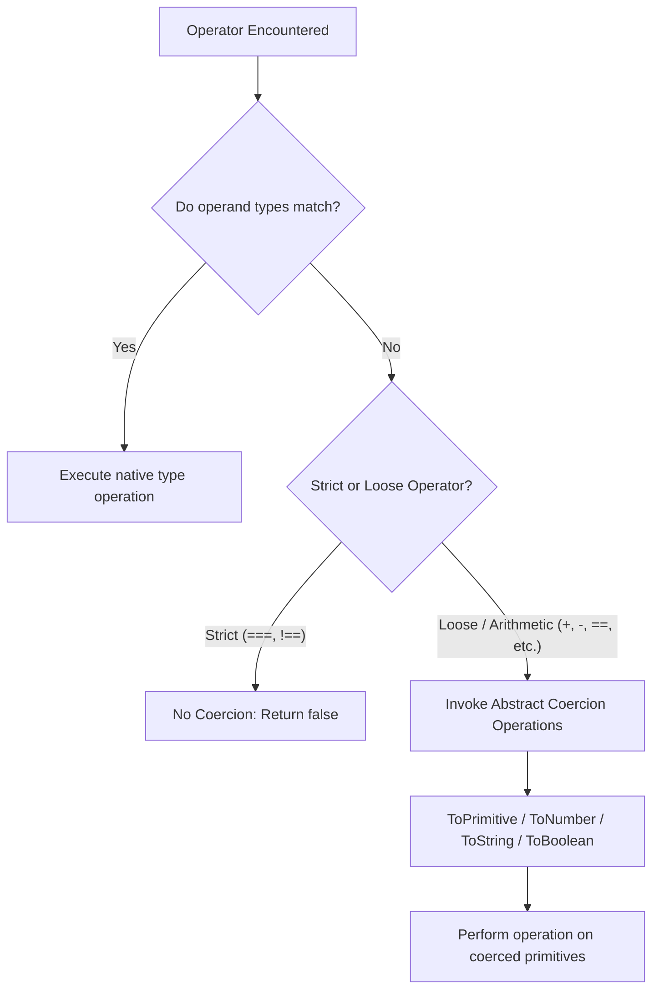

# Topic 9: Operators, Comparisons & Type Coercion

> **MAD-II Week 1 | Detailed Notes**

---

## Overview

JavaScript is a **dynamically typed** and **weakly typed** language:
- **Dynamic typing** means variable types are resolved at runtime rather than compile-time.
- **Weak typing** means JavaScript permits operations between mismatched types by silently converting (coercing) values behind the scenes rather than raising a compile-time or runtime error.

This design decision was intentional. In May 1995, Brendan Eich designed JavaScript for Netscape Navigator under strict instructions to make the language forgiving for non-professional programmers writing light browser scripts (validating form fields, handling button clicks). A script throwing an unhandled type exception would halt execution and break the webpage. Therefore, JavaScript was designed to **"keep running at all costs"** by guessing what type conversion the programmer intended.

While this makes simple tasks forgiving, implicit type coercion is arguably JavaScript's most notorious source of subtle, production-breaking bugs. Mastering operators, implicit coercion rules, and comparison algorithms is essential for writing predictable, robust full-stack code.



---

## 9.1 Arithmetic & Assignment Operators

Operators in JavaScript fall into three structural categories based on operand count:
1. **Unary operators**: Accept one operand (e.g., `+x`, `-x`, `++x`, `!x`, `typeof x`).
2. **Binary operators**: Accept two operands (e.g., `a + b`, `a * b`, `a == b`).
3. **Ternary operator**: Accepts three operands (`condition ? exprIfTrue : exprIfFalse`).

---

### Arithmetic Operators

| Operator | Name | Example | Coercion Behavior |
| :--- | :--- | :--- | :--- |
| `+` | **Addition / Concatenation** | `a + b` | **Overloaded**: If either operand is a string, coerces both to strings. Otherwise, coerces to numbers. |
| `-` | **Subtraction** | `a - b` | Purely numeric. Coerces both operands to numbers (`ToNumber`). |
| `*` | **Multiplication** | `a * b` | Purely numeric. Coerces both operands to numbers. |
| `/` | **Division** | `a / b` | Purely numeric. Returns float. Division by zero yields `Infinity` or `-Infinity`. |
| `%` | **Remainder (Modulo)** | `a % b` | Purely numeric. Returns remainder of integer division (retains sign of dividend). |
| `**` | **Exponentiation (ES2016)** | `a ** b` | Purely numeric. Equivalent to `Math.pow(a, b)`. |
| `++` | **Increment** | `++x` or `x++` | Numeric. Adds `1` to variable (coerces to number if needed). |
| `--` | **Decrement** | `--x` or `x--` | Numeric. Subtracts `1` from variable. |

---

### The Dual Nature of the `+` Operator

The `+` operator is the **only arithmetic operator that is overloaded** to perform both mathematical addition and string concatenation.

#### The Rule of `+`:
When evaluating `a + b`:
1. Both operands are converted to primitive values using the abstract operation `ToPrimitive()`.
2. **If either operand is a string**, the other operand is coerced to a string via `ToString()`, and **concatenation** is performed.
3. **If neither operand is a string**, both operands are coerced to numbers via `ToNumber()`, and **numeric addition** is performed.

```javascript
// Pure numeric addition:
5 + 10           // 15
5 + true         // 6  (true -> 1)
5 + null         // 5  (null -> 0)
5 + undefined    // NaN (undefined -> NaN)

// String concatenation triggered:
"Hello " + "World"  // "Hello World"
"5" + 10            // "510"  (10 coerced to "10")
5 + "10"            // "510"  (5 coerced to "5")
"Score: " + true    // "Score: true"
"Value: " + null    // "Value: null"
"Data: " + undefined // "Data: undefined"
```

#### Left-to-Right Associativity Pitfall:
Because `+` evaluates from left to right, operand order drastically alters output:

```javascript
// Left-to-right evaluation:
1 + 2 + "3"
// Step 1: 1 + 2 -> 3 (both numbers)
// Step 2: 3 + "3" -> "33" (string concatenation)
// Result: "33"

"1" + 2 + 3
// Step 1: "1" + 2 -> "12" (string concatenation)
// Step 2: "12" + 3 -> "123" (string concatenation)
// Result: "123"

// Explicit grouping with parentheses overrides associativity:
"1" + (2 + 3)
// Step 1: (2 + 3) -> 5
// Step 2: "1" + 5 -> "15"
// Result: "15"
```

> [!WARNING]
> **Real-World Form Input Bug**: HTML `<input>` elements always return user input as a string (`HTMLInputElement.value`).
> ```javascript
> const input1 = "50"; // from document.getElementById("price").value
> const input2 = "10"; // from document.getElementById("tax").value
> 
> const total = input1 + input2; 
> console.log(total); // "5010" — NOT 60!
> ```
> Always parse form values explicitly using `Number()`, `parseInt()`, or the unary `+` operator.

---

### Non-`+` Arithmetic Operators Force Numeric Conversion

Unlike `+`, operators `-`, `*`, `/`, `%`, and `**` have **no string variant**. They strictly force conversion to `Number`:

```javascript
"10" - 5         // 5    ("10" -> 10)
"10" * "2"       // 20   (both -> 10 and 2)
"100" / "25"     // 4
"10" % "3"       // 1
"2" ** "3"       // 8

// If the string cannot be parsed as a valid number, you get NaN:
"hello" - 2      // NaN  ("hello" -> NaN)
"10px" * 2       // NaN  ("10px" has trailing letters -> NaN)
undefined * 2    // NaN  (undefined -> NaN)
null * 2         // 0    (null -> 0)
true * 10        // 10   (true -> 1)
false * 10       // 0    (false -> 0)
```

---

### Unary `+` and `-` Operators

The unary `+` operator provides the cleanest, highest-performance idiom in JavaScript to explicitly convert any value to a number:

```javascript
// Unary + as an explicit number cast:
+"42"            // 42 (Number)
+"3.1415"        // 3.1415
+""              // 0  (empty string coerces to 0)
+"   "           // 0  (whitespace-only string coerces to 0)
+true            // 1
+false           // 0
+null            // 0
+undefined       // NaN
+"hello"         // NaN

// Unary - negates after numeric coercion:
-"42"            // -42
-true            // -1
-false           // -0
```

> [!TIP]
> **`+str` vs. `parseInt(str)` vs. `Number(str)`**:
> - `+str` and `Number(str)` parse the **entire** string. If any illegal characters exist (e.g., `"120px"`), they yield `NaN`.
> - `parseInt(str, 10)` parses from left to right until an invalid character is found (`parseInt("120px", 10)` returns `120`).

---

### Assignment Operators

#### Basic & Compound Assignment
```javascript
let count = 10;

count += 5;   // count = count + 5  -> 15
count -= 3;   // count = count - 3  -> 12
count *= 2;   // count = count * 2  -> 24
count /= 4;   // count = count / 4  -> 6
count %= 4;   // count = count % 4  -> 2
count **= 3;  // count = count ** 3 -> 8
```

#### Modern Logical Assignment Operators (ES2021 / ES12)
ES2021 introduced short-circuit logical assignment operators, eliminating boilerplate checks:

```javascript
// 1. Logical OR assignment (||=)
// Assigns ONLY if current value is FALSY
let title = "";
title ||= "Untitled Document"; // title becomes "Untitled Document"

let existingTitle = "Report";
existingTitle ||= "Untitled Document"; // unchanged: "Report"

// 2. Logical AND assignment (&&=)
// Assigns ONLY if current value is TRUTHY
let user = { name: "Alice", active: true };
user.active &&= sendWelcomeEmail(user); // Executes only if user.active is truthy

// 3. Nullish Coalescing assignment (??=)
// Assigns ONLY if current value is NULL or UNDEFINED (preserves 0 and "")
let config = { timeout: 0, retries: undefined };

config.timeout ??= 3000;  // Remains 0 (0 is valid, not null/undefined!)
config.retries ??= 3;     // Becomes 3 (retries was undefined)
```

---

## 9.2 Type Coercion Pitfalls

Type coercion occurs when JavaScript expects one data type in an operation or context, but receives another.

There are two forms of type casting:
1. **Explicit Type Casting (Type Conversion)**: The developer manually invokes a conversion function (e.g., `String(x)`, `Number(x)`, `Boolean(x)`).
2. **Implicit Type Coercion**: The JavaScript runtime automatically converts the type behind the scenes based on ECMAScript abstract operations.

---

### The Fundamental Abstract Operations (ECMA-262)

The ECMAScript specification defines internal algorithms that dictate all coercion. The three most critical are:

#### 1. `ToBoolean`
Evaluates any value to either `true` or `false`.

There are **exactly 8 falsy values** in JavaScript. Every other value in the language is **truthy**.

| The 8 Falsy Values | Description |
| :--- | :--- |
| `false` | The boolean literal |
| `0` | Positive numeric zero |
| `-0` | Negative numeric zero |
| `0n` | BigInt zero |
| `""` | Empty string (length 0) |
| `null` | The intentional non-value |
| `undefined` | The uninitialized/missing value |
| `NaN` | "Not a Number" |

> [!IMPORTANT]
> **Surprising Truthy Values (Common Gotchas)**:
> - `"0"` (non-empty string containing the character zero) $\rightarrow$ **truthy**
> - `"false"` (non-empty string containing characters) $\rightarrow$ **truthy**
> - `" "` (string with just whitespace) $\rightarrow$ **truthy**
> - `[]` (empty array — it is an object) $\rightarrow$ **truthy**
> - `{}` (empty object literal) $\rightarrow$ **truthy**
> - `function() {}` (any function) $\rightarrow$ **truthy**

```javascript
// Empty array is truthy in boolean context:
if ([]) {
    console.log("Empty array executes!"); // This WILL print!
}

if ("0") {
    console.log("String '0' executes!");   // This WILL print!
}
```

---

#### 2. `ToNumber`
Converts non-numeric types to numbers when evaluated by arithmetic operators, unary `+`, or numeric comparisons:

| Input Value | Converted Number (`ToNumber`) | Notes |
| :--- | :--- | :--- |
| `undefined` | `NaN` | Does not represent a numerical quantity |
| `null` | `0` | Historical legacy decision in JS |
| `true` | `1` | Standard boolean mapping |
| `false` | `0` | Standard boolean mapping |
| `""` (empty string) | `0` | Whitespace-only strings also coerce to `0` |
| `"42"` | `42` | Valid numeric string parses correctly |
| `"3.14"` | `3.14` | Valid float string parses correctly |
| `"foo"`, `"10px"` | `NaN` | Invalid numeric strings evaluate to `NaN` |
| `Symbol(...)` | **Throws `TypeError`** | Symbols cannot be coerced to numbers |
| `10n` (BigInt) | **Throws `TypeError`** | BigInt cannot implicitly mix with Number |

```javascript
// Contrast undefined vs null:
null + 10        // 10   (null becomes 0)
undefined + 10   // NaN  (undefined becomes NaN)
```

---

#### 3. `ToPrimitive`
When an object (like an Array, Date, or Object literal) is used in a primitive context (e.g., `obj + 5` or `obj == "hello"`), JavaScript converts it to a primitive value.

The algorithm checks for:
1. `obj[Symbol.toPrimitive](hint)` if defined.
2. Otherwise, calls `.valueOf()` and `.toString()` in an order determined by the context (hint).
   - For strings: calls `.toString()` first, then `.valueOf()`.
   - For numbers/default: calls `.valueOf()` first, then `.toString()`.

For standard plain objects and arrays:
- `[].toString()` yields `""` (empty array converts to empty string).
- `[1, 2, 3].toString()` yields `"1,2,3"`.
- `[42].toString()` yields `"42"`.
- `{}.toString()` yields `"[object Object]"`.

---

### The Notorious Object/Array Coercion Puzzles

Understanding `ToPrimitive` explains the classic JavaScript coercion anomalies:

#### Case 1: `[] + []`
```javascript
[] + [] // ""
```
**Mechanism**:
1. Binary `+` requires primitive operands.
2. Both arrays invoke `ToPrimitive`.
3. `[].toString()` returns `""`.
4. We evaluate `"" + ""` $\rightarrow$ `""` (empty string).

#### Case 2: `[] + {}`
```javascript
[] + {} // "[object Object]"
```
**Mechanism**:
1. `ToPrimitive([])` $\rightarrow$ `""`.
2. `ToPrimitive({})` $\rightarrow$ `"[object Object]"`.
3. Concatenation: `"" + "[object Object]"` $\rightarrow$ `"[object Object]"`.

#### Case 3: `{} + []`
```javascript
// In Node.js / Browser Console as a standalone statement:
{} + [] // 0  (in some REPLs / older browsers)
```
**Mechanism**:
JavaScript parsers see `{}` at the start of a statement as an **empty code block** rather than an object literal!
The remaining expression is parsed as `+[]` (unary plus on an empty array).
1. `+[]` coerces `[]` to a number.
2. `ToPrimitive([])` $\rightarrow$ `""`.
3. `ToNumber("")` $\rightarrow$ `0`.
4. Result: `0`.
*(Note: Wrapping in parentheses `({} + [])` forces `{}` to parse as an object expression, correctly yielding `"[object Object]"`).*

---

### Logical Operators Return Values, Not Booleans

In languages like C, C++, or Java, logical AND (`&&`) and logical OR (`||`) return strict boolean values (`true` or `false`).

In JavaScript, **logical operators return the value of one of their operands directly**, performing short-circuit evaluation:

```javascript
// Logical OR (||): Returns the FIRST TRUTHY operand, or the last operand if all are falsy
const username = userProvidedName || "Guest";
// If userProvidedName is "Alice" -> returns "Alice"
// If userProvidedName is "" -> "" is falsy -> returns "Guest"

// Logical AND (&&): Returns the FIRST FALSY operand, or the last operand if all are truthy
const authenticated = true;
const renderDashboard = authenticated && showDashboard();
// If authenticated is true -> evaluates and returns showDashboard()
// If authenticated is false -> returns false immediately without calling showDashboard()
```

#### Short-Circuiting Table:

| Expression | Evaluates To | Reason |
| :--- | :--- | :--- |
| `"hello" \|\| "world"` | `"hello"` | First operand is truthy; short-circuits immediately |
| `"" \|\| "world"` | `"world"` | First operand is falsy; returns second |
| `null \|\| undefined` | `undefined` | First operand is falsy; returns second (even if falsy) |
| `"hello" && 42` | `42` | First is truthy; continues and returns second |
| `0 && "hello"` | `0` | First operand is falsy; short-circuits and returns `0` |
| `null && false` | `null` | First operand is falsy; short-circuits and returns `null` |

> [!CAUTION]
> **The `||` False-Positive Trap**:
> Using `||` for default settings fails when valid data includes `0`, `""`, or `false`:
> ```javascript
> function setFontSize(size) {
>     const fontSize = size || 16; // If size is 0, 0 is falsy! fontSize becomes 16!
>     return fontSize;
> }
> setFontSize(0); // Returns 16, bug!
> 
> // Solution: Use ES2020 Nullish Coalescing (??)
> function setFontSizeSafe(size) {
>     return size ?? 16; // Only falls back on null or undefined
> }
> setFontSizeSafe(0); // Correctly returns 0
> ```

---

## 9.3 Equality: Loose (`==`) vs. Strict (`===`)

JavaScript provides two primary equality comparison operators:
- **`==` (Loose Equality / Abstract Equality)**: Compares values **with** implicit type coercion.
- **`===` (Strict Equality)**: Compares both **type** and **value** without coercion.

There are also the inequality counterparts: `!=` (loose inequality) and `!==` (strict inequality).

---

### Strict Equality (`===`)

The strict equality operator compares values without allowing type conversions:

```javascript
a === b
```

#### The Strict Equality Algorithm:
1. If `typeof a !== typeof b`, return **`false`**.
2. If `typeof a` is `number`:
   - If either `a` or `b` is `NaN`, return **`false`** (since `NaN !== NaN`).
   - If `a` is `+0` and `b` is `-0`, return **`true`** (IEEE 754 zeros are equal).
   - If values are the same number, return **`true`**.
3. If `typeof a` is `string`, `boolean`, `bigint`, or `symbol`:
   - Return `true` if they represent identical characters / boolean state / symbol identity.
4. If `typeof a` is `null` or `undefined`:
   - `null === null` $\rightarrow$ `true`
   - `undefined === undefined` $\rightarrow$ `true`
5. If `a` and `b` are objects:
   - Return `true` **only if they reference the identical object in memory**.

```javascript
// Strict equality examples:
42 === 42            // true
42 === "42"          // false (types differ: number vs. string)
true === 1           // false (boolean vs. number)
null === undefined   // false (object/null vs. undefined)

// Object reference identity:
const obj1 = { id: 1 };
const obj2 = { id: 1 };
const obj3 = obj1;

obj1 === obj2        // false (different objects in heap memory)
obj1 === obj3        // true  (identical memory reference)

[] === []            // false (two distinct array instances)
```

---

### Loose Equality (`==`)

The loose equality operator applies the complex **Abstract Equality Comparison Algorithm** defined in ECMAScript Section 7.2.14:

#### Simplified Abstract Equality Rules (`x == y`):
1. **Same Type**: If `typeof x === typeof y`, perform strict equality `x === y`.
2. **`null` and `undefined`**: 
   - `null == undefined` $\rightarrow$ **`true`**
   - `undefined == null` $\rightarrow$ **`true`**
   - `null` and `undefined` do **not** loosely equal any other value in the language.
3. **Number and String**:
   - If one is a `number` and the other is a `string`, convert the string to a number using `ToNumber(string)` and re-compare.
4. **Boolean Involved**:
   - If either operand is a `boolean`, convert the boolean to a number (`true -> 1`, `false -> 0`) and re-compare!
5. **Object compared with Primitive (String, Number, BigInt, Symbol)**:
   - Convert the object to a primitive using `ToPrimitive(object)` and re-compare.

---

### Dissecting Famous Loose Equality Anomalies

#### Anomaly 1: Why `"0" == false` is `true`, yet `"0"` is truthy

This is the quintessential JavaScript paradox:

```javascript
"0" == false;      // true
Boolean("0");      // true
if ("0") {         // This conditional runs!
    console.log("Truthy!");
}
```

**Step-by-step trace of `"0" == false`**:
1. One operand is boolean (`false`). Rule 4 triggers: convert `false` to a number $\rightarrow$ `0`.
   - Expression becomes: `"0" == 0`
2. One operand is string, one is number. Rule 3 triggers: convert `"0"` to a number $\rightarrow$ `0`.
   - Expression becomes: `0 == 0`
3. Types match (both numbers). Strict equality applies: `0 === 0` $\rightarrow$ **`true`**.

**Why `if ("0")` runs**:
The `if` statement invokes `ToBoolean("0")`. Any non-empty string is **truthy**. Coercion rules for `ToBoolean` are separate from the algorithm for `==`!

---

#### Anomaly 2: Why `[] == ![]` is `true`

```javascript
[] == ![] // true
```

**Step-by-step trace**:
1. Operator precedence: The unary logical NOT operator `!` has higher precedence than `==`.
2. Evaluate `![]`:
   - Array `[]` is an object, hence **truthy**.
   - `!truthy` evaluates to **`false`**.
   - Expression becomes: `[] == false`
3. Boolean comparison rule: convert `false` to number $\rightarrow$ `0`.
   - Expression becomes: `[] == 0`
4. Object vs. Number rule: convert `[]` to primitive via `ToPrimitive([])`.
   - `[].toString()` yields `""`.
   - Expression becomes: `"" == 0`
5. String vs. Number rule: convert `""` to number via `ToNumber("")` $\rightarrow$ `0`.
   - Expression becomes: `0 == 0`
6. Both are numbers: `0 === 0` $\rightarrow$ **`true`**.

---

#### Anomaly 3: Array Comparisons with Zero
```javascript
0 == ""       // true  ("" converts to 0)
0 == "0"      // true  ("0" converts to 0)
"" == "0"     // false (both are strings! identical types -> no coercion -> different strings!)

0 == []       // true  ([] -> "" -> 0)
0 == [0]      // true  ([0] -> "0" -> 0)
0 == ['']     // true  ([''] -> "" -> 0)
```

Notice the breakdown of transitivity:
If $a = b$ and $b = c$, then $a = c$ should hold.
- `0 == ""` is `true`.
- `0 == "0"` is `true`.
- Yet `"" == "0"` is **`false`**!

Because `==` violates basic mathematical transitivity, it is dangerous in control logic.

---

### The Equality Comparison Matrix

| Comparison | Loose (`==`) | Strict (`===`) | Explanation |
| :--- | :---: | :---: | :--- |
| `0 == false` | `true` | `false` | `false` coerces to `0` in `==` |
| `"" == false` | `true` | `false` | Both coerce to `0` in `==` |
| `"" == 0` | `true` | `false` | `""` coerces to `0` in `==` |
| `"0" == 0` | `true` | `false` | `"0"` coerces to `0` in `==` |
| `"1" == true` | `true` | `false` | Both coerce to `1` in `==` |
| `null == undefined` | `true` | `false` | Special loose equality exemption in spec |
| `null == 0` | `false` | `false` | `null` only loosely equals `undefined` |
| `undefined == 0` | `false` | `false` | `undefined` only loosely equals `null` |
| `NaN == NaN` | `false` | `false` | `NaN` is not equal to anything, including itself |
| `[] == false` | `true` | `false` | `[] -> "" -> 0`, `false -> 0` |
| `[1] == 1` | `true` | `false` | `[1] -> "1" -> 1` |
| `[1, 2] == "1,2"` | `true` | `false` | `[1, 2] -> "1,2"` |
| `{}` == `"[object Object]"` | `true` | `false` | `{}` converts to `"[object Object]"` |
| `{} == {}` | `false` | `false` | Distinct object references in memory |
| `[] == []` | `false` | `false` | Distinct array references in memory |

---

### When (If Ever) Should You Use `==`?

In modern software engineering, the industry standard is to **use `===` everywhere**.

However, there is **one widely accepted idiomatic exception**: checking for both `null` and `undefined` simultaneously.

```javascript
// The one acceptable loose equality idiom:
if (value == null) {
    // Triggers if value is null OR value is undefined
    console.log("Value is missing");
}

// Strict equality equivalent (requires two checks):
if (value === null || value === undefined) {
    console.log("Value is missing");
}
```

Because `null == undefined` is `true`, and neither equals any other value under `==`, `value == null` is guaranteed safe and concise.

> [!TIP]
> In TypeScript and modern codebases configured with linters (such as ESLint's `eqeqeq` rule), `===` is enforced across all expressions, often allowing `value == null` as the sole exception.

---

### The Third Equality Check: `Object.is()` (ES2015)

JavaScript has a third equality mechanism called `Object.is()`, which implements the **SameValue** algorithm.

`Object.is()` behaves identically to `===`, with exactly **two differences**:

1. **`NaN` equality**:
   ```javascript
   NaN === NaN;           // false
   Object.is(NaN, NaN);   // true
   ```
2. **`+0` vs. `-0` distinction**:
   ```javascript
   +0 === -0;             // true
   Object.is(+0, -0);     // false
   ```

`Object.is()` is commonly used internally by frontend frameworks like **React** and **Vue** to determine if component state or props have changed and require a re-render.

---

## 9.4 Relational Comparisons (`<`, `<=`, `>`, `>=`)

Relational comparison operators also perform type coercion, but follow different rules than equality operators:

```javascript
// Rule 1: If both operands are strings, compare lexicographically (dictionary order):
"apple" < "banana"     // true
"10" < "9"             // true! ("1" comes before "9" alphabetically)
"100" < "2"            // true!

// Rule 2: If at least one operand is not a string, coerce BOTH to numbers:
10 < "9"               // false ("9" -> 9, 10 < 9 is false)
"10" > 2               // true  ("10" -> 10, 10 > 2 is true)
true > 0               // true  (true -> 1, 1 > 0 is true)
null >= 0              // true! (null -> 0, 0 >= 0 is true)
```

### The `null` Relational Paradox
Compare these three expressions carefully:

```javascript
null > 0;   // false  (null -> 0, 0 > 0 is false)
null == 0;  // false  (null does NOT coerce to 0 for ==; only equals undefined)
null >= 0;  // true!  (null -> 0, 0 >= 0 is true!)
```

**Why does this happen?**
- In `null > 0`, relational coercion converts `null` to `0` $\rightarrow$ `0 > 0` is `false`.
- In `null == 0`, the equality algorithm specifically forbids coercing `null` to numbers $\rightarrow$ yields `false`.
- In `null >= 0`, JavaScript evaluates `>=` not as `(null > 0 || null == 0)`, but as the inverse of `<`: `!(null < 0)`. Since `null < 0` is `false` (`0 < 0`), `!false` evaluates to **`true`**!

---

## Summary & Best Practices

```
                                    ┌───────────────────────┐
                                    │    COMPARING VALUES   │
                                    └───────────┬───────────┘
                                                │
                       ┌────────────────────────┴────────────────────────┐
                       ▼                                                 ▼
             Checking Identity?                                Checking Magnitude?
             (a === b or a !== b)                              (a < b, a <= b, etc.)
                       │                                                 │
          ┌────────────┴────────────┐                        Ensure BOTH operands are
          ▼                         ▼                        strictly converted first!
   Different types?          Same type?                      Number(a) < Number(b)
   ALWAYS returns false      Compare by value (primitives)
                             Compare by reference (objects)
```

### Golden Rules for Modern JavaScript:
1. **Always use `===` and `!==`**: Avoid `==` to prevent unintended coercions that break mathematical logic and open edge-case security flaws.
2. **The only exception for `==`**: `val == null` to conveniently test for `null` or `undefined` simultaneously.
3. **Parse inputs explicitly**:
   - For numbers: use `Number(str)`, `+str`, or `parseInt(str, 10)`. Never rely on implicit arithmetic conversion.
   - For booleans: use `Boolean(val)` or double negation `!!val`.
   - For strings: use `String(val)` or template literals `${val}`.
4. **Use Nullish Coalescing (`??`) instead of Logical OR (`||`)** when defaulting values where `0`, `""`, or `false` are valid inputs.
5. **Remember the 8 Falsy values**: `false`, `0`, `-0`, `0n`, `""`, `null`, `undefined`, `NaN`. Everything else is truthy.
6. **Arrays and Objects are compared by reference**: `[] === []` is always `false`. To compare object or array contents, inspect elements individually or serialize them.
