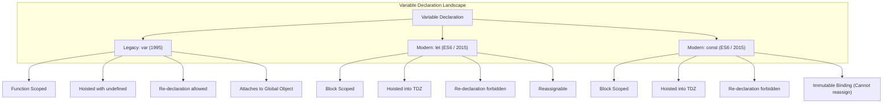

# Topic 10: Variables, Declarations & Scoping Rules

> **MAD-II Week 1 | Detailed Notes**

---

## Overview

A **variable** is a named binding between an identifier and a value stored in system memory. How a programming language manages variables—how they are declared, where they are visible (scoping), and how their lifecycles are managed in memory (hoisting and garbage collection)—forms the backbone of its execution model.

JavaScript's variable system has a dramatic history:
- From **1995 to 2015 (ES1 to ES5)**, JavaScript had only one declaration keyword: `var`. Variables were function-scoped, hoisted with an initial value of `undefined`, and if you forgot to type `var`, JavaScript quietly created an accidental global variable.
- In **2015 (ES6 / ECMAScript 2015)**, TC39 overhauled the language by introducing `let` and `const`. These introduced true **block scoping**, the **Temporal Dead Zone (TDZ)**, and **binding immutability**, solving two decades of bugs and architectural pitfalls.

Understanding the difference between the legacy paradigm (`var`) and the modern standard (`let` / `const`) is essential for maintaining existing codebases and building modern, bug-free web applications.



---

## 10.1 Variable Declaration Paradigms

### JavaScript vs. Python: Explicit Declaration Required

In Python (which you learned in MAD-I), variables do not require a declaration keyword. A variable is created the moment a value is assigned to it:

```python
# Python: Assignment implicitly creates a local or module-level variable
x = 10
total_users = 100
```

In JavaScript, variables **must be explicitly declared** using a keyword (`let`, `const`, or legacy `var`).

#### The Accidental Global Disaster (Sloppy Mode):
If you assign a value to an identifier in JavaScript without declaring it first, JavaScript does not throw a syntax error in non-strict (sloppy) mode. Instead, it navigates all the way up the scope chain and, failing to find the variable, **creates it as a global property on the global object** (`window` in browsers, `global` in Node.js):

```javascript
function calculateTax() {
    // BUG: Missing let/const/var!
    taxRate = 0.18; // Pollutes global scope! window.taxRate = 0.18
    return 1000 * taxRate;
}

calculateTax();
console.log(window.taxRate); // 0.18 (!) Leaked into global namespace
```

This creates disastrous side-effects: other scripts or functions can unintentionally overwrite `taxRate`, causing unpredictable behavior.

#### The Modern Remedy: `"use strict"`
In ES5, JavaScript introduced **Strict Mode**. In strict mode, assigning to an undeclared identifier immediately throws a runtime `ReferenceError`:

```javascript
"use strict";

function calculateTax() {
    taxRate = 0.18; // ReferenceError: taxRate is not defined
    return 1000 * taxRate;
}
```

> [!IMPORTANT]
> **Modern JS is strict by default**: All ES Modules (`<script type="module">` or files with `import`/`export`) and JavaScript classes automatically execute in strict mode. Explicit declaration with `const` or `let` is mandatory.

---

### JavaScript vs. C / C++ / Java: Dynamic Typing

Languages like C, C++, and Java are **statically typed**. In these languages, the variable itself is bound to a fixed data type, and the compiler enforces type checks before execution:

```c
/* C / C++: Static typing */
int age = 25;
age = "twenty-five"; /* COMPILE ERROR: incompatible types */
```

JavaScript is **dynamically typed**. The variable is simply an identifier bound to a memory location. **Types belong to values, not variables.** Any variable can hold any data type at any time during execution:

```javascript
let data = 42;          // data holds a Number
data = "Hello world";   // Valid: data now holds a String
data = [1, 2, 3];       // Valid: data now holds an Array (Object)
data = { active: true };// Valid: data now holds an Object literal
```

While dynamic typing provides flexibility and rapid prototyping, it removes compile-time type guarantees. This is why TypeScript (a statically typed superset of JavaScript) was created and has become the industry standard for large web applications.

---

## 10.2 Scope Mechanics

**Scope** defines the accessibility and visibility of variables, functions, and objects in some particular part of your code during runtime.

JavaScript features four distinct scoping levels:
1. **Global Scope**
2. **Module Scope**
3. **Function Scope**
4. **Block Scope**

```
┌──────────────────────────────────────────────────────────┐
│ GLOBAL SCOPE (window / globalThis)                       │
│  let appName = "MyApp";                                  │
│                                                          │
│  ┌────────────────────────────────────────────────────┐  │
│  │ MODULE SCOPE (ES Module / File)                    │  │
│  │  const apiKey = "secret_123";                      │  │
│  │                                                    │  │
│  │  ┌──────────────────────────────────────────────┐  │  │
│  │  │ FUNCTION SCOPE                               │  │  │
│  │  │  function processUser(id) {                  │  │  │
│  │  │   var localCount = 1;                        │  │  │
│  │  │                                              │  │  │
│  │  │   ┌──────────────────────────────────────┐   │  │  │
│  │  │   │ BLOCK SCOPE                          │   │  │  │
│  │  │   │  if (id > 0) {                       │   │  │  │
│  │  │   │    let status = "active";            │   │  │  │
│  │  │   │    const token = 999;                │   │  │  │
│  │  │   │  } // status & token destroyed here  │   │  │  │
│  │  │   └──────────────────────────────────────┘   │  │  │
│  │  │  }                                           │  │  │
│  │  └──────────────────────────────────────────────┘  │  │
│  └────────────────────────────────────────────────────┘  │
└──────────────────────────────────────────────────────────┘
```

---

### 1. Global Scope
A variable declared outside of any function or block resides in the **global scope**. It can be read and modified from anywhere in the application.

- **In the Browser**: The global object is `window`.
- **In Node.js**: The global object is `global`.
- **Universal Cross-Platform Standard (ES2020)**: `globalThis` points to the global object regardless of environment (browser, Node, Web Worker, Deno, Bun).

#### The Problem with Global Variables:
- **Namespace Collision**: Multiple scripts or third-party libraries using the same global variable name (`let user = ...`) overwrite each other without warning.
- **Memory Leaks**: Global variables remain in memory for the lifetime of the application and are never garbage-collected.
- **Security Risks**: Any script running on the page (including malicious third-party analytics or ads) can read and modify global data.

---

### 2. Module Scope
When JavaScript files are loaded as ES modules (e.g., `<script type="module" src="app.js">` or using `import`/`export` syntax), the top level of the file is **module-scoped**, not global-scoped.

Variables declared at the top of a module are private to that file unless explicitly shared via the `export` keyword:

```javascript
// mathUtils.js
const privateMultiplier = 2; // NOT visible to other files or window

export function double(n) {   // Explicitly exposed
    return n * privateMultiplier;
}
```

---

### 3. Function Scope
Variables declared inside a function are local to that function and cannot be accessed from outside:

```javascript
function authenticate() {
    var secretToken = "xyz-123";
    let userId = 42;
    const role = "admin";
}

authenticate();
console.log(secretToken); // ReferenceError: secretToken is not defined
console.log(userId);      // ReferenceError: userId is not defined
console.log(role);        // ReferenceError: role is not defined
```

Historically (before ES6), functions were the **only** mechanism JavaScript had to create a new scope. This forced developers to write complex IIFEs (Immediately Invoked Function Expressions) simply to create temporary variables without leaking them into the surrounding code.

---

### 4. Block Scope (ES6)
A **block** is any code enclosed within a pair of curly braces `{ ... }`. This includes:
- `if (...) { ... }`
- `for (...) { ... }`
- `while (...) { ... }`
- `switch (...) { ... }`
- Standalone blocks: `{ ... }`

Variables declared with **`let`** and **`const`** are strictly **block-scoped**:

```javascript
if (true) {
    let blockScopedLet = "visible only in block";
    const blockScopedConst = "also visible only in block";
    var functionScopedVar = "I ignore blocks!";
}

console.log(functionScopedVar);   // "I ignore blocks!" (var leaks out!)
console.log(blockScopedLet);     // ReferenceError: blockScopedLet is not defined
console.log(blockScopedConst);   // ReferenceError: blockScopedConst is not defined
```

> [!CAUTION]
> **The `var` Block-Scope Blindness**:
> `var` completely ignores curly-brace blocks (except functions). A `var` declared inside an `if` statement or `for` loop bleeds into the enclosing function or global scope.

---

### Lexical Scoping & The Scope Chain

JavaScript uses **lexical scoping** (also known as static scoping):
- The scope of an identifier is determined by **where it is physically written in the source code**, not where or how the function is called at runtime.
- When an identifier is referenced, the JavaScript engine performs an identifier resolution by traversing up the **Scope Chain**:
  1. Searches the current local block / function.
  2. If not found, searches the enclosing (outer) block / function.
  3. Continues outward until it reaches the global scope.
  4. If not found in the global scope, it throws a `ReferenceError`.

#### Variable Shadowing:
When an inner scope declares a variable with the exact same name as an outer scope, the inner variable **shadows** (hides) the outer variable within that block:

```javascript
let score = 100; // Outer scope

function updateGame() {
    let score = 500; // Shadows the outer 'score'
    console.log("Inside:", score); // 500
}

updateGame();
console.log("Outside:", score);    // 100 (outer unchanged)
```

---

## 10.3 Declaration Keywords: `var`, `let`, and `const`

### Comprehensive Comparison Table

| Feature | `var` (Legacy ES1) | `let` (Modern ES6) | `const` (Modern ES6) |
| :--- | :--- | :--- | :--- |
| **Scope** | **Function scope** (ignores blocks) | **Block scope** `{ ... }` | **Block scope** `{ ... }` |
| **Hoisting Behavior** | Hoisted and initialized to `undefined` | Hoisted into **Temporal Dead Zone (TDZ)** | Hoisted into **Temporal Dead Zone (TDZ)** |
| **Re-declaration** | **Allowed** within same scope | **Forbidden** (Throws `SyntaxError`) | **Forbidden** (Throws `SyntaxError`) |
| **Re-assignment** | **Allowed** | **Allowed** | **Forbidden** (Throws `TypeError`) |
| **Initial Value Required?** | No (defaults to `undefined`) | No (defaults to `undefined`) | **Yes** (Throws `SyntaxError` if omitted) |
| **Global Object Property** | Creates property on `window`/`global` | Does **not** attach to global object | Does **not** attach to global object |
| **Modern Recommendation** | **NEVER USE** | Use when reassignment is needed | **DEFAULT TO THIS** |

---

### 1. Legacy `var`: Mechanics and Hazards

#### Hazard A: Block-Level Leakage in Loops
Because `var` is function-scoped, a loop variable declared with `var` leaks outside the loop:

```javascript
for (var i = 0; i < 5; i++) {
    // Doing work...
}

console.log("After loop, i is:", i); // 5! Leaked out of loop!
```

#### Hazard B: The Classic Asynchronous Closure Bug
Consider this classic interview and production problem:

```javascript
for (var i = 0; i < 3; i++) {
    setTimeout(function() {
        console.log(i);
    }, 100);
}
// Expected Output: 0, 1, 2
// Actual Output:   3, 3, 3!
```

**Why does this happen?**
1. Because `var` is function-scoped, there is **only one single `i` variable** allocated in memory for all iterations of the loop.
2. The `setTimeout` callbacks are asynchronous and are scheduled to execute after the loop finishes.
3. By the time the callbacks fire 100ms later, the loop has completed, and `i` has incremented to `3`.
4. All three callbacks reference the *exact same* single memory binding for `i`, printing `3, 3, 3`.

**How `let` instantly fixes this:**
```javascript
for (let i = 0; i < 3; i++) {
    setTimeout(function() {
        console.log(i);
    }, 100);
}
// Output: 0, 1, 2 (Correct!)
```
**Why?** The ECMAScript specification explicitly defines that for `for (let ...)` loops, JavaScript **creates a brand-new lexical binding of `i` for each iteration**. Each callback captures its own isolated copy of `i`.

#### Hazard C: Accidental Re-declaration
`var` allows the same variable name to be re-declared within the same scope without warning:

```javascript
var accountBalance = 1000;
// ... 200 lines of code ...
var accountBalance = 0; // Silently overwrites! No error thrown!
```
With `let` or `const`, this throws an immediate `SyntaxError: Identifier 'accountBalance' has already been declared`.

---

### 2. Modern `let` & The Temporal Dead Zone (TDZ)

A variable declared with `let` is reassignable and block-scoped:

```javascript
let count = 0;
count = 1; // Valid reassignment
count = count + 5; // Valid
```

#### What is the Temporal Dead Zone (TDZ)?
Many beginners are told: *"var is hoisted, but let and const are not hoisted."* **This is a technical misconception.**

In JavaScript, **all declarations (`var`, `let`, `const`, `function`, `class`) are hoisted** to the top of their enclosing scope during the compilation/creation phase. 

The critical difference is how they are initialized:
- `var`: Hoisted and **immediately initialized to `undefined`**.
- `let` and `const`: Hoisted, but **left uninitialized**. They enter the **Temporal Dead Zone (TDZ)**.

> **Definition**: The **Temporal Dead Zone** is the temporal span between entering the scope where the variable is declared and the actual line of code where the variable is initialized. Accessing a variable while it is in the TDZ immediately throws a `ReferenceError`.

```javascript
console.log(a); // Output: undefined (hoisted & initialized to undefined)
var a = 10;

console.log(b); // ReferenceError: Cannot access 'b' before initialization!
let b = 20;     // TDZ for 'b' ends here
```

#### Proof that `let` is Hoisted:
If `let` were not hoisted, the following code would output `"global"` because it would fall back to the outer scope. Instead, it throws a `ReferenceError`:

```javascript
let text = "global";

{
    // The TDZ for inner 'text' begins the instant this block opens!
    console.log(text); // ReferenceError: Cannot access 'text' before initialization
    
    let text = "local"; // Declaration reached; TDZ ends
}
```
The error proves that the inner `let text` was hoisted and shadowed the outer `text`, but because execution had not reached the declaration line yet, reading it was forbidden.

---

### 3. Modern `const`: Immutable Bindings vs. Mutable Values

A variable declared with `const` has the same scoping and TDZ rules as `let`, with two critical differences:
1. It **must be initialized** immediately upon declaration.
2. The identifier **cannot be reassigned**.

```javascript
const maxLimit = 100;
maxLimit = 200; // TypeError: Assignment to constant variable

const uninitialized; // SyntaxError: Missing initializer in const declaration
```

---

### Reference Immutability vs. Value Mutability

This is one of the most frequently tested concepts in JavaScript interviews and examinations:

> [!WARNING]
> **`const` prevents REASSIGNMENT of the identifier; it does NOT make objects or arrays immutable!**

When you assign an Object or Array to a variable, the variable stores a **memory address (reference)** pointing to the heap memory where the object data lives. 

`const` guarantees that the variable will always point to that exact same memory address. It does **not** protect the internal contents of that object from being modified (mutated).

```javascript
// Example 1: Arrays with const
const fruits = ["apple", "banana"];

// Legal: Mutating the internal array contents:
fruits.push("cherry");
fruits[0] = "avocado";
console.log(fruits); // ["avocado", "banana", "cherry"]

// Illegal: Reassigning the variable to a new array reference:
fruits = ["orange", "grape"]; 
// TypeError: Assignment to constant variable!
```

```javascript
// Example 2: Objects with const
const user = {
    name: "Alice",
    role: "Admin"
};

// Legal: Modifying, adding, or deleting properties:
user.role = "SuperAdmin";
user.lastLogin = "2026-09-05";
delete user.role;
console.log(user); // { name: "Alice", lastLogin: "2026-09-05" }

// Illegal: Reassigning the user reference:
user = { name: "Bob" }; 
// TypeError: Assignment to constant variable!
```

#### How to Achieve Actual Object Immutability:
If you require an object whose properties cannot be modified, added, or deleted, use **`Object.freeze()`**:

```javascript
const systemConfig = Object.freeze({
    apiEndpoint: "https://api.example.com/v1",
    timeoutMs: 5000
});

systemConfig.timeoutMs = 10000; // Silently fails in sloppy mode; throws TypeError in strict mode!
console.log(systemConfig.timeoutMs); // Still 5000
```

*(Note: `Object.freeze()` is shallow. Nested objects inside frozen objects can still be mutated unless you recursively apply a deep freeze).*

---

## 10.4 Scope Leaks, Namespaces & Isolation Patterns

### 1. Accidental Scope Leaks
Common causes of unintended memory leaks related to variable declarations:
- **Forgetting `let` or `const`**: Creates an unintended property on `globalThis` / `window`.
- **Dangling Event Listeners**: Attaching callbacks that close over large data structures without removing them when no longer needed.
- **Accidental closures in timer loops**: Retaining variables in memory indefinitely through `setInterval`.

### 2. Historical Namespace Isolation: IIFEs
Before ES6 introduced modules and block scope, JavaScript developers had to wrap entire files and libraries in **Immediately Invoked Function Expressions (IIFEs)** to prevent polluting the global namespace:

```javascript
// The Pre-ES6 Pattern: IIFE
(function() {
    var privateKey = "secret";
    
    function internalHelper() {
        return privateKey.toUpperCase();
    }
    
    // Expose only public API to window
    window.MyLibrary = {
        run: internalHelper
    };
})();

console.log(typeof privateKey); // "undefined" (not leaked!)
```

### 3. The Modern Solution: ES Modules (ESM)
Today, **ES Modules have made IIFEs obsolete for namespace isolation**:
- Every file loaded with `<script type="module">` or bundled via modern tools (Vite, Webpack) automatically has its own private scope.
- Variables do not leak into the global environment.
- Only items explicitly marked with `export` are accessible to other modules.

---

## Summary: Best Practices Checklist

```
                      ┌──────────────────────────────┐
                      │    DECLARING A VARIABLE      │
                      └──────────────┬───────────────┘
                                     │
                  ┌──────────────────┴──────────────────┐
                  ▼                                     ▼
        Will the variable's                    Do you think you
        BINDING be reassigned?                 need `var`?
                  │                                     │
         ┌────────┴────────┐                            ▼
         ▼                 ▼                       NO! NEVER!
        YES                NO                  `var` is obsolete
         │                 │                   and dangerous.
         ▼                 ▼
     Use `let`         Use `const`
     (e.g., loop       (DEFAULT choice
      counters,         for objects, arrays,
      accumulators)     functions, primitives)
```

### Key Takeaways:
1. **Default to `const` for everything**: Over 80–90% of variables in clean modern codebases never need to be reassigned. Using `const` signals to readers (and the JavaScript engine optimizer) that the reference is stable.
2. **Use `let` only when reassignment is mandatory**: Loop counters (`for (let i = 0; ...)`), accumulators, and state flags that change values over time.
3. **Never use `var` in modern JavaScript**: It is a legacy keyword that breaks block scoping, hoists with `undefined`, permits silent re-declarations, and introduces subtle asynchronous bugs.
4. **Remember the TDZ**: Variables declared with `let` and `const` exist throughout their block scope, but cannot be read or written until execution passes their declaration.
5. **Remember `const` mutability**: `const` freezes the **binding**, not the **value**. Arrays and objects declared with `const` can still be mutated unless locked with `Object.freeze()`.
