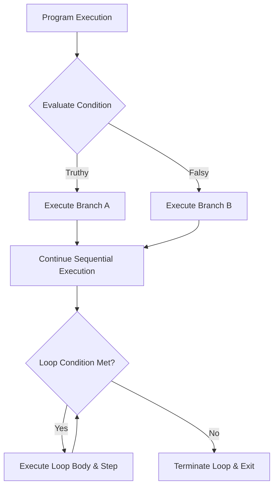

# Topic 11: Control Flow Constructs

> **MAD-II Week 1 | Detailed Notes**

---

## Overview

By default, the JavaScript runtime executes code **sequentially**—from top to bottom, one statement after another. **Control flow constructs** allow programmers to divert, branch, or repeat this execution path based on runtime conditions, state evaluations, and data structures.

Control flow constructs in JavaScript fall into three broad classes:
1. **Conditional Branching**: Choosing between alternative execution paths (`if`, `else if`, `else`, ternary `?:`).
2. **Multi-Way Branching**: Matching an expression against multiple predefined values (`switch ... case`).
3. **Iteration & Loops**: Repeating execution blocks until a boundary condition is satisfied (`for`, `while`, `do ... while`).

Because JavaScript is **single-threaded** in the browser, control flow carries unique architectural implications: poorly constructed synchronous loops can completely freeze the browser tab, blocking UI rendering and user interactions.



---

## 11.1 Conditional Branching

### The `if`, `else if`, `else` Ladder

The `if` statement evaluates an expression inside parentheses. If the expression evaluates to a **truthy** value (via the internal `ToBoolean` abstract operation), the accompanying block executes.

```javascript
const userScore = 85;

if (userScore >= 90) {
    console.log("Grade: A");
} else if (userScore >= 80) {
    console.log("Grade: B");
} else if (userScore >= 70) {
    console.log("Grade: C");
} else {
    console.log("Grade: F");
}
```

#### Implicit Truthy/Falsy Evaluation in Conditions
The condition inside `if (...)` is coerced into a boolean automatically. You do **not** need to write `if (isValid === true)`:

```javascript
let activeUsers = 5;

// Idiomatic: Evaluates ToBoolean(activeUsers). 5 is non-zero, hence truthy:
if (activeUsers) {
    console.log("There are active users online.");
}

let inputName = "";
// "" is falsy:
if (!inputName) {
    console.log("Name field cannot be blank!");
}
```

> [!WARNING]
> **The Zero Pitfall**:
> If `0` is a valid input (e.g., a bank account balance, an index, or an item count), evaluating `if (balance)` will treat `0` as **falsy**!
> ```javascript
> const balance = 0;
> if (balance) {
>     // WILL NOT RUN because 0 is falsy!
>     renderAccount(balance);
> }
> 
> // Correct: Explicit comparison
> if (balance !== undefined && balance !== null) {
>     renderAccount(balance);
> }
> ```

---

### Curly Braces: Always Mandatory in Clean Code

JavaScript permits omitting curly braces if an `if` statement contains only a single statement:

```javascript
// Valid syntax, but HIGHLY DISCOURAGED:
if (isLoggedIn)
    redirectDashboard();
```

Omitting braces is widely recognized as a **critical anti-pattern** in production software. It introduces catastrophic indentation traps:

```javascript
// DANGEROUS:
if (userIsAdmin)
    deleteDatabase();
    notifyAdmin(); // THIS ALWAYS RUNS regardless of userIsAdmin!
```

Because `notifyAdmin()` is not part of the `if` body (only the immediate first statement is), it executes unconditionally. This syntax omission caused Apple's famous 2014 **"goto fail" SSL/TLS security vulnerability**.

> [!IMPORTANT]
> **Production Standard**: Always wrap control flow bodies in curly braces `{ ... }`, even for single-line statements.

---

### The Guard Clause Pattern (Early Return)

Deeply nested `if-else` blocks create what developers call the **"Pyramid of Doom"** or **Arrow Anti-pattern**, making code difficult to read, test, and maintain.

#### The Bad Pattern (Deep Nesting):
```javascript
function processOrder(order) {
    if (order) {
        if (order.items && order.items.length > 0) {
            if (order.paymentStatus === "PAID") {
                // Actual core business logic buried 4 levels deep:
                shipOrder(order);
                return { success: true };
            } else {
                return { error: "Payment required" };
            }
        } else {
            return { error: "Cart is empty" };
        }
    } else {
        return { error: "Invalid order" };
    }
}
```

#### The Professional Pattern (Guard Clauses):
Invert the conditions and return early. The function exits as soon as an error or invalid state is encountered, keeping the main logic flat and at zero indentation:

```javascript
function processOrder(order) {
    // Guard Clause 1: Order exists?
    if (!order) {
        return { error: "Invalid order" };
    }

    // Guard Clause 2: Has items?
    if (!order.items || order.items.length === 0) {
        return { error: "Cart is empty" };
    }

    // Guard Clause 3: Paid?
    if (order.paymentStatus !== "PAID") {
        return { error: "Payment required" };
    }

    // Happy path: Clean, un-nested, and immediately readable
    shipOrder(order);
    return { success: true };
}
```

---

### The Conditional (Ternary) Operator (`?:`)

The **ternary operator** is JavaScript's only operator that takes three operands:
```javascript
condition ? expressionIfTrue : expressionIfFalse
```

#### Statement vs. Expression:
- An `if ... else` construct is a **statement**—it performs actions but does **not evaluate to a value**. You cannot assign an `if` statement to a variable.
- The ternary operator is an **expression**—it produces a value that can be assigned, returned, or passed as a parameter.

```javascript
const age = 20;

// Verbose using statement:
let accessLevel;
if (age >= 18) {
    accessLevel = "Adult";
} else {
    accessLevel = "Minor";
}

// Idiomatic and concise using ternary expression:
const accessLevel = age >= 18 ? "Adult" : "Minor";
```

#### Multi-Branch (Nested) Ternaries:
Ternary operators can be chained to represent multiple branches:

```javascript
const score = 85;

const grade = score >= 90 ? "A"
            : score >= 80 ? "B"
            : score >= 70 ? "C"
            : "F";
```

> [!TIP]
> **Readability Rule**: Use single ternaries for simple binary state selections (`const label = isOpen ? "Close" : "Open"`). If branching logic exceeds two conditions or contains side-effects, use `if-else` or `switch` instead of nested ternaries.

---

## 11.2 Multi-Way Branching: `switch ... case`

When a single variable or expression must be evaluated against numerous discrete constant values, a `switch` statement provides a structured alternative to a long chain of `else if` statements.

```javascript
const userRole = "editor";

switch (userRole) {
    case "admin":
        console.log("Full system access granted.");
        break;
    case "editor":
        console.log("Can edit and publish content.");
        break;
    case "viewer":
        console.log("Read-only access granted.");
        break;
    default:
        console.log("Unknown role. Access denied.");
        break;
}
```

---

### The Strict Equality Rule (`===`)

> [!CAUTION]
> **`switch` uses Strict Equality (`===`) exclusively.**

The `switch` statement evaluates cases against the test expression using the **Strict Equality Comparison Algorithm** (`===`). **No type coercion is performed.**

```javascript
const code = "200";

switch (code) {
    case 200: // Number 200 !== String "200"
        console.log("Success");
        break;
    default:
        console.log("No match found!"); // This WILL execute!
}
```

Because `"200" === 200` is `false`, the case does not match.

---

### Fall-Through Mechanics & The `break` Statement

The `break` keyword stops execution of the `switch` block and jumps execution to the first statement following the switch.

If you omit `break`, execution continues unconditionally into the subsequent `case` blocks, regardless of whether their case expressions match! This is known as **fall-through**:

```javascript
const level = 1;

switch (level) {
    case 1:
        console.log("Level 1 completed");
        // BUG: Forgot break!
    case 2:
        console.log("Level 2 completed"); // Executes!
    case 3:
        console.log("Level 3 completed"); // Executes!
        break;
    default:
        console.log("Game Over");
}
// Outputs:
// "Level 1 completed"
// "Level 2 completed"
// "Level 3 completed"
```

#### Intentional Fall-Through (Grouping Cases):
Fall-through is useful when multiple cases share the exact same logic:

```javascript
const day = "Saturday";

switch (day) {
    case "Monday":
    case "Tuesday":
    case "Wednesday":
    case "Thursday":
    case "Friday":
        console.log("Weekday: Set alarm for 7:00 AM.");
        break;

    case "Saturday":
    case "Sunday":
        console.log("Weekend: Alarm disabled.");
        break;

    default:
        console.log("Invalid day of the week.");
}
```

---

### Block Scoping Inside `switch` Statements

A notorious trap in JavaScript is that **the entire `switch` statement shares a single lexical scope**. Declaring a `let` or `const` with the same name across different `case` blocks throws a `SyntaxError`:

```javascript
// SYNTAX ERROR:
switch (action) {
    case "login":
        let message = "Welcome!"; // Error: Identifier 'message' has already been declared
        break;
    case "logout":
        let message = "Goodbye!"; // Error!
        break;
}
```

#### The Solution: Wrap `case` bodies in curly braces `{ ... }`
Enclosing the case body inside a block `{ ... }` creates a private block scope for that case:

```javascript
switch (action) {
    case "login": {
        let message = "Welcome!"; // Scoped strictly to this case block
        console.log(message);
        break;
    }
    case "logout": {
        let message = "Goodbye!"; // Distinct, legal lexical scope
        console.log(message);
        break;
    }
}
```

---

### Modern Alternative: Object / Map Lookup Tables

In modern JavaScript and frontend development (e.g., Vue methods, React reducers), long `switch` statements are often replaced with clean **dictionary / object lookups**:

```javascript
// Modern Dictionary Dispatch:
const rolePermissions = {
    admin:  ["read", "write", "delete"],
    editor: ["read", "write"],
    viewer: ["read"]
};

function getPermissions(role) {
    return rolePermissions[role] ?? ["none"];
}

console.log(getPermissions("editor")); // ["read", "write"]
console.log(getPermissions("guest"));  // ["none"]
```
This pattern is declarative, easier to extend dynamically, and avoids switch-scoping and fall-through bugs.

---

## 11.3 Iteration & Loops

Loops repeat a block of statements until a termination condition evaluates to `false`.

---

### 1. The Classic `for` Loop

The classic `for` loop contains three optional expressions separated by semicolons:
```javascript
for (initialization; condition; final-expression) {
    // Loop body
}
```

```javascript
for (let i = 0; i < 5; i++) {
    console.log(`Iteration: ${i}`);
}
// Outputs: 0, 1, 2, 3, 4
```

#### Execution Order:
1. **Initialization**: `let i = 0` runs once before anything else.
2. **Condition**: `i < 5` is evaluated. If truthy, proceed; if falsy, exit.
3. **Body**: `{ console.log(...); }` executes.
4. **Final-Expression**: `i++` increments the counter.
5. Repeat from Step 2.

> [!NOTE]
> **Recall from Topic 10**: Always declare the loop index with **`let`**, never `var`. `let` creates a distinct, isolated lexical binding for each loop iteration, preserving closures in asynchronous operations.

---

### 2. The `while` Loop

A `while` loop evaluates its condition **before** executing the loop body. If the condition begins as `false`, the body **never executes**:

```javascript
let attempts = 0;
const maxRetries = 3;

while (attempts < maxRetries) {
    console.log(`Connection attempt ${attempts + 1}...`);
    attempts++;
}
```

Use `while` loops when the number of iterations cannot be known ahead of time (e.g., polling an API until a status changes or reading from a stream).

---

### 3. The `do ... while` Loop

A `do ... while` loop evaluates its condition **after** executing the body. Therefore, the body is **guaranteed to run at least once**, regardless of the condition:

```javascript
let count = 10;

do {
    console.log(`Count is: ${count}`);
    count++;
} while (count < 5);

// Output: "Count is: 10" (Runs once despite 10 not being < 5!)
```

**Practical Use Case**: Gathering user input, processing initial handshake requests, or running a workflow where an initial run is required before testing validity.

---

### Loop Control Keywords: `break` and `continue`

#### 1. `break`
Immediately terminates the innermost loop and transfers execution to the statement immediately following the loop:

```javascript
for (let i = 1; i <= 10; i++) {
    if (i === 6) {
        console.log("Terminating loop at 6.");
        break; // Exits loop entirely
    }
    console.log(i);
}
// Outputs: 1, 2, 3, 4, 5, "Terminating loop at 6."
```

#### 2. `continue`
Terminates execution of statements in the **current iteration** only, skipping directly to the next loop evaluation (increment in `for`, condition in `while`):

```javascript
for (let i = 1; i <= 5; i++) {
    if (i === 3) {
        continue; // Skip the rest of this iteration when i is 3
    }
    console.log(i);
}
// Outputs: 1, 2, 4, 5 (3 is skipped)
```

---

### Labeled Statements (Breaking Nested Loops)

In standard JavaScript, `break` only exits the immediate loop in which it is nested. To break out of an **outer loop** from within an inner nested loop, JavaScript supports **Labeled Statements**:

```javascript
outerLoop: for (let row = 0; row < 3; row++) {
    for (let col = 0; col < 3; col++) {
        if (row === 1 && col === 1) {
            console.log(`Target found at [${row}, ${col}]. Aborting entire grid search.`);
            break outerLoop; // Terminates BOTH loops!
        }
        console.log(`Checking [${row}, ${col}]`);
    }
}
```

---

## 11.4 Browser Performance & The Single-Thread Hazard

Unlike multi-threaded server environments, JavaScript in the browser runs on a **single main execution thread**. 

This single thread is responsible for:
1. Executing your JavaScript code.
2. Parsing and computing CSS styles.
3. Calculating layout geometry.
4. Repainting pixels on the screen (60 frames per second).
5. Processing user input (clicks, scrolls, typing).

### The Danger of Infinite or Heavy Synchronous Loops:
```javascript
// CATASTROPHIC:
while (true) {
    // Infinite synchronous execution
}
```

If a loop never terminates, or takes seconds to process a massive dataset:
- The browser tab **completely freezes**.
- Buttons cannot be clicked, text cannot be highlighted, animations stutter and stop.
- The browser eventually prompts the user with an *"Unresponsive Page — Kill or Wait"* modal.

> [!IMPORTANT]
> **Web Application Design Principle**: Heavy computations or large array processing should never block the main browser thread. Modern web development achieves this using:
> - **Asynchronous Batching** (`setTimeout`, `requestAnimationFrame`)
> - **Web Workers** (background multi-threading in the browser)

---

## Summary & Best Practices Checklist

| Construct | Best Suited For | Key Watch-Out |
| :--- | :--- | :--- |
| `if ... else` | Dynamic, range-based, or boolean conditions | Always use `{ ... }` to prevent accidental execution leaks. |
| **Guard Clauses** | Validating inputs and error checking at function start | Invert conditions and return early to eliminate nested pyramids. |
| **Ternary (`?:`)** | Assigning values or returning expressions conditionally | Keep simple. Avoid chaining multiple levels of nested ternaries. |
| `switch ... case` | Matching one expression against many known constants | Uses `===` (no coercion). Always include `break;` and `default;`. |
| `for (let i = 0...)` | Fixed, deterministic iteration counts | Always declare loop index with `let`. |
| `while` | Indeterminate loops where condition is checked first | Ensure condition variable updates to prevent infinite loops. |
| `do ... while` | Scenarios where body must execute at least once | Remember body runs before condition check. |
| **Object Lookup** | Replacing large `switch` blocks with dictionary mapping | Highly scalable, clean, and declarative alternative to `switch`. |
