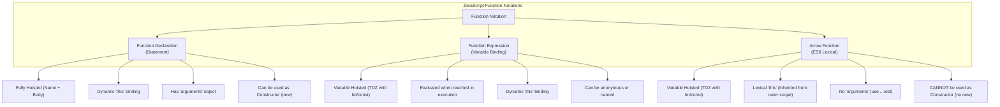

# Topic 12: Functions & Execution Patterns



## Learning objectives

By the end of this topic, you should be able to:

- Explain the main ideas covered in **Topic 12: Functions & Execution Patterns**.
- Connect these ideas to modern web application development.
- Recognize the patterns, terminology, and trade-offs used in practice.

> **MAD-II Week 1 | Detailed Notes**

---

## Overview

In JavaScript, **functions are first-class citizens**. They are not merely subroutines or methods attached to classes; they are full-fledged objects (`Function` instances) that can be stored in variables, passed as arguments, returned from other functions, and endowed with arbitrary properties.

When Brendan Eich created JavaScript in 1995, his core architectural vision was to combine the functional programming elegance of **Scheme** (first-class functions, lexical closures) with a syntax familiar to **Java** developers. 

Understanding how functions are declared, how they resolve scope, how they behave with hoisting, and how execution patterns have evolved from legacy **IIFEs** to modern **Arrow Functions** and **ES Modules** is central to mastering modern web development.



---

## 12.1 Function Concepts

A function encapsulates a block of reusable code designed to perform a specific task or calculate a result.

```javascript
// Basic Function Anatomy:
function calculateTotal(price, taxRate = 0.18) { // Parameters (with default value)
    const tax = price * taxRate;
    return price + tax;                          // Return value
}

const finalAmount = calculateTotal(100);         // Argument passed: 100
console.log(finalAmount);                        // 118
```

---

### Parameters vs. Arguments

- **Parameters**: The named identifiers listed in the function's definition/signature (`price`, `taxRate`). They act as local variable declarations inside the function body.
- **Arguments**: The actual runtime values supplied to the function when it is invoked (`100`).

#### 1. Default Parameters (ES6)
Before ES6, default parameters required defensive boilerplate checking:
```javascript
// Pre-ES6 clumsy default parameter pattern:
function connect(host, port) {
    port = port || 8080; // Bug: port 0 is falsy, would incorrectly overwrite with 8080!
}

// Modern ES6 Default Parameters:
function connect(host = "localhost", port = 8080) {
    console.log(`Connecting to ${host}:${port}`);
}
connect();                  // "Connecting to localhost:8080"
connect("127.0.0.1", 3000); // "Connecting to 127.0.0.1:3000"
```

#### 2. Rest Parameters (`...args`) vs. The Legacy `arguments` Object
JavaScript allows functions to be called with any number of arguments, regardless of how many parameters are declared:

```javascript
// Legacy pre-ES6 pattern: The 'arguments' object
function sumOld() {
    // 'arguments' is an "Array-like" object (has .length, indexed access), but NOT an Array!
    // It lacks .map(), .filter(), .reduce() unless converted manually.
    let total = 0;
    for (let i = 0; i < arguments.length; i++) {
        total += arguments[i];
    }
    return total;
}

// Modern ES6 Pattern: Rest Parameters
function sumModern(...numbers) {
    // 'numbers' is a TRUE JavaScript Array instance!
    return numbers.reduce((acc, curr) => acc + curr, 0);
}

console.log(sumModern(1, 2, 3, 4, 5)); // 15
```

> [!IMPORTANT]
> **Modern Standard**: Avoid the legacy `arguments` object. Use ES6 **Rest Parameters** (`...args`). Rest parameters produce a real array, work cleanly with arrow functions, and clearly document in the function signature that multiple inputs are accepted.

---

### First-Class Citizenship

In computer science, a programming language is said to have **First-Class Functions** when functions are treated as first-class citizens. This means functions can do anything a standard value (like a Number or String) can do:

#### 1. Functions can be assigned to variables, object properties, or array slots
```javascript
// Assigned to variable:
const logger = function(msg) { console.log(msg); };

// Stored in an object (Method):
const calculator = {
    add: (a, b) => a + b,
    multiply: (a, b) => a * b
};

// Stored in an array:
const operations = [
    (n) => n + 1,
    (n) => n * 2,
    (n) => n ** 2
];
```

#### 2. Functions can be passed as arguments to other functions (Callbacks)
A function passed into another function to be executed later is called a **callback function**:
```javascript
function performCalculation(a, b, operationCallback) {
    return operationCallback(a, b);
}

const add = (x, y) => x + y;
const multiply = (x, y) => x * y;

console.log(performCalculation(5, 3, add));      // 8
console.log(performCalculation(5, 3, multiply)); // 15
```

This capability is the bedrock of event handling in web browsers (e.g., `button.addEventListener("click", handleClick)`).

#### 3. Functions can be returned from other functions (Higher-Order Functions & Factories)
A **Higher-Order Function (HOF)** is a function that accepts another function as an argument, returns a function, or both:

```javascript
// A Function Factory:
function createMultiplier(factor) {
    // Returns an inner function that "remembers" the factor parameter:
    return function(number) {
        return number * factor;
    };
}

const double = createMultiplier(2);
const triple = createMultiplier(3);

console.log(double(10)); // 20
console.log(triple(10)); // 30
```

> [!NOTE]
> When `createMultiplier` returns the inner function, that inner function maintains access to the `factor` variable even after `createMultiplier` has finished executing and returned. This powerful mechanism is called a **Closure**.

#### 4. Functions are Objects and can have properties attached to them
Because functions inherit from `Function.prototype` (which inherits from `Object.prototype`), they can store custom properties:
```javascript
function generateId() {
    return ++generateId.counter;
}
generateId.counter = 0; // Storing state directly on the function object

console.log(generateId()); // 1
console.log(generateId()); // 2
console.log(generateId.name);   // "generateId" (built-in property)
console.log(generateId.length); // 0 (number of declared parameters)
```

---

## 12.2 Function Notations & Syntaxes

JavaScript provides three distinct ways to define functions, each with unique scoping, hoisting, and runtime semantics.

---

### 1. Function Declarations (Statements)

A **Function Declaration** begins with the `function` keyword, followed by a mandatory name identifier, parameter list, and body:

```javascript
function greetUser(name) {
    return `Hello, ${name}!`;
}
```

#### Complete Function Hoisting:
Function declarations are **hoisted in their entirety** (both the function name and its complete implementation body) to the top of their enclosing scope during the compilation phase:

```javascript
// Valid! Can be invoked BEFORE the declaration line appears:
console.log(sayHello("Alice")); // "Hello, Alice!"

function sayHello(name) {
    return `Hello, ${name}!`;
}
```

**Why does JavaScript do this?**
Brendan Eich designed this intentionally to allow developers to structure code naturally—putting high-level orchestration logic at the top of a file, and relegating low-level helper functions to the bottom, without worrying about declaration order.

---

### 2. Function Expressions

A **Function Expression** creates a function as part of an assignment expression. The function is stored in a variable:

```javascript
// Anonymous Function Expression:
const calculateSquare = function(n) {
    return n * n;
};

// Named Function Expression:
const factorial = function fact(n) {
    if (n <= 1) return 1;
    return n * fact(n - 1); // Identifier 'fact' is available internally for recursion
};
```

#### Hoisting Behavior of Function Expressions:
Unlike function declarations, **function expressions are NOT hoisted as functions**:

```javascript
console.log(calculateArea(5)); // ReferenceError: Cannot access 'calculateArea' before initialization

const calculateArea = function(radius) {
    return Math.PI * radius * radius;
};
```

The variable `calculateArea` is declared with `const`, so it resides in the **Temporal Dead Zone (TDZ)** until the assignment line is executed. 

*(If declared with `var`, `var calculateArea` would be hoisted as `undefined`, causing a runtime `TypeError: calculateArea is not a function` if called before the line).*

---

### 3. Arrow Functions (`=>`) — ES6

Introduced in ES6 (2015), **Arrow Functions** provide a concise syntax and resolve JavaScript's longstanding problems with the dynamic `this` keyword.

#### Syntax Variations:

```javascript
// 1. Standard multi-parameter with block body:
const add = (a, b) => {
    return a + b;
};

// 2. Concise Body (Implicit Return):
// When curly braces are omitted, the evaluated expression is automatically returned:
const addConcise = (a, b) => a + b;

// 3. Single parameter (parentheses are optional):
const square = x => x * x;

// 4. Zero parameters (parentheses are mandatory):
const getRandom = () => Math.random();

// 5. Returning an Object Literal (CRITICAL GOTCHA):
// Curly braces normally signify a code block. To implicitly return an object,
// wrap the object literal in parentheses:
const createUser = (id, username) => ({ id: id, username: username });
```

---

### Critical Differences: Arrow Functions vs. Standard Functions

Arrow functions are **not** just syntax sugar for standard functions. They have four fundamental architectural differences:

| Feature | Standard Function (`function`) | Arrow Function (`=>`) |
| :--- | :--- | :--- |
| **`this` Binding** | **Dynamic**: Bound at runtime based on **how** the function is invoked. | **Lexical**: Inherits `this` from the enclosing lexical scope where it was defined. |
| **`arguments` Object** | Available (`arguments`) | **Not available** (Throws `ReferenceError` or accesses outer function's arguments). Use `...rest` instead. |
| **Constructor Usage** | Can be invoked with `new` (`new MyFunc()`) | **CANNOT** be invoked with `new` (Throws `TypeError: ... is not a constructor`). |
| **Prototype Property** | Has `.prototype` | Has **no** `.prototype` property (lightweight in memory). |
| **Hoisting** | Depends on declaration vs expression | Bound to variable (`const`/`let`), subject to TDZ. |

#### The Lexical `this` Revolution:
In traditional JavaScript functions, the `this` keyword is dynamic and frequently breaks when passed to asynchronous callbacks or event handlers:

```javascript
// THE CLASSIC 'this' BUG:
const timer = {
    seconds: 0,
    start: function() {
        // Traditional function creates its own dynamic 'this':
        setInterval(function() {
            this.seconds++; // In non-strict mode, 'this' refers to 'window', NOT 'timer'!
            console.log(this.seconds); // NaN
        }, 1000);
    }
};
```

Before ES6, developers had to resort to ugly workarounds like `var self = this;` or `.bind(this)`.

**Arrow functions permanently solve this** because they capture the `this` of the enclosing context:

```javascript
// THE MODERN ARROW FUNCTION SOLUTION:
const timer = {
    seconds: 0,
    start: function() {
        // Arrow function lexically captures 'this' from start() method:
        setInterval(() => {
            this.seconds++; // 'this' correctly refers to timer object!
            console.log(this.seconds); // 1, 2, 3...
        }, 1000);
    }
};
```

---

## 12.3 Anonymous Functions & IIFEs

### Anonymous Functions

An **anonymous function** is a function that does not have an identifier name:

```javascript
// Anonymous function passed directly as an inline callback:
const numbers = [1, 2, 3, 4, 5];

const doubled = numbers.map(function(num) {
    return num * 2;
});

// Even cleaner with anonymous arrow function:
const tripled = numbers.map(num => num * 3);
```

**Trade-offs of Anonymous Functions**:
- **Pros**: Clean, throwaway logic; avoids polluting namespace with single-use names.
- **Cons**: In older debuggers or unminified error traces, errors in anonymous functions appear as `(anonymous function)` in the call stack, making stack trace debugging slightly harder.

---

### Immediately Invoked Function Expressions (IIFEs)

An **IIFE** (pronounced *"iffy"*) is a function that is executed immediately upon being defined:

```javascript
(function() {
    console.log("I run immediately upon being defined!");
})();

// Or using Arrow Syntax:
(() => {
    console.log("Immediate arrow execution!");
})();
```

#### The Mechanics of IIFE Syntax:
1. JavaScript syntax forbids executing a function declaration immediately:
   ```javascript
   function() {}(); // SYNTAX ERROR: unexpected token '('
   ```
2. Wrapping the function in parentheses `(function() { ... })` forces the JavaScript parser to treat the code as an **expression** rather than a statement.
3. The trailing parentheses `()` immediately invoke that expression.

---

### Historical Role: Pre-ES6 Variable Encapsulation

From **1995 to 2015**, JavaScript had **no block scope** (only `var`) and **no official module system** (no `import` / `export`). 

If multiple scripts ran on a webpage, any variable declared outside a function became a global variable on `window`. To prevent variable collisions, developers used IIFEs to construct a **private scope barrier**:

```javascript
// The Revealing Module Pattern (Pre-2015 Standard):
var CounterModule = (function() {
    // Private variables hidden inside the IIFE closure:
    var privateCounter = 0;

    function logChange() {
        console.log("Counter changed to:", privateCounter);
    }

    // Public API returned to the outside world:
    return {
        increment: function() {
            privateCounter++;
            logChange();
        },
        getValue: function() {
            return privateCounter;
        }
    };
})();

CounterModule.increment(); // "Counter changed to: 1"
console.log(CounterModule.privateCounter); // undefined (completely protected!)
```

---

### Modern Assessment: Why IIFEs are Discouraged in Modern ES6+

In modern JavaScript (ES6+), **IIFEs are largely obsolete and considered an anti-pattern for regular code**:

1. **Native Block Scope (`let` and `const`)**:
   If you need a temporary local scope, you no longer need a function wrapper. Just open a curly-brace block:
   ```javascript
   {
       let temporaryCalc = 10 * 20;
       console.log(temporaryCalc);
   }
   // temporaryCalc is destroyed here; no leakage!
   ```

2. **Native ES Modules (ESM)**:
   Modern JavaScript uses native modules (`<script type="module">`, `import`, and `export`). Every module file is **automatically isolated in its own private module scope**. Top-level variables do not leak to the global `window` object.

3. **Modern Build Tools**:
   Bundlers like Vite, Rollup, and Webpack automatically manage scoping, variable mangling, and isolation behind the scenes.

#### When are IIFEs still used today?
- **Top-Level `await` Fallback**: In legacy environments that do not support ES2022 top-level await:
  ```javascript
  (async () => {
      const data = await fetchUserData();
      render(data);
  })();
  ```
- **Self-Contained Browser Extensions / Bookmarklets**: Injecting a standalone script onto third-party web pages without risking variable collisions with the host page.

---

## Comparison Matrix: When to Use Which Function Notation

| Notation | Syntax Example | Hoisting | `this` Binding | Primary Use Case |
| :--- | :--- | :--- | :--- | :--- |
| **Function Declaration** | `function calculate() {}` | Fully Hoisted | Dynamic | Top-level application logic, exported utilities, recursive functions. |
| **Function Expression** | `const calc = function() {}` | TDZ / Not Hoisted | Dynamic | Assigning functions conditionally, object method assignments. |
| **Arrow Function** | `const calc = () => {}` | TDZ / Not Hoisted | **Lexical** | Callbacks (`map`, `filter`, `setTimeout`), event handlers needing parent `this`, concise functional transforms. |
| **Method Shorthand** | `const obj = { run() {} }` | Not Hoisted | Dynamic | Defining methods inside Object literals or ES6 Classes. |
| **IIFE** | `(() => {})()` | Executed at definition | Lexical / Dynamic | Legacy script isolation, self-executing initialization scripts. |

---

## Summary: Best Practices Checklist

1. **Default to Arrow Functions for Callbacks**: Use `arr.map(x => x * 2)` or `setTimeout(() => ..., 1000)` to ensure predictable lexical `this` behavior.
2. **Use Function Declarations for Top-Level Utilities**: They hoist cleanly, making file organization natural and readable.
3. **Never use Arrow Functions for Object Methods if they require `this`**:
   ```javascript
   // ANTI-PATTERN:
   const user = {
       name: "Alice",
       greet: () => `Hi, I am ${this.name}` // BUG: 'this' points to window/global, NOT user!
   };

   // CORRECT: Use ES6 Method Shorthand:
   const user = {
       name: "Alice",
       greet() { return `Hi, I am ${this.name}`; }
   };
   ```
4. **Use Rest Parameters (`...args`) instead of `arguments`**: Rest parameters yield true arrays and work consistently across both standard and arrow functions.
5. **Replace IIFEs with ES Modules**: Structure your projects as modules using `import`/`export` rather than wrapping code in self-invoking function wrappers.

## Further practice

- Revisit the examples in this topic and explain each step in your own words.
- Identify one place where the concept could be used in a web application.
- Test a small variation and note how the behavior changes.

