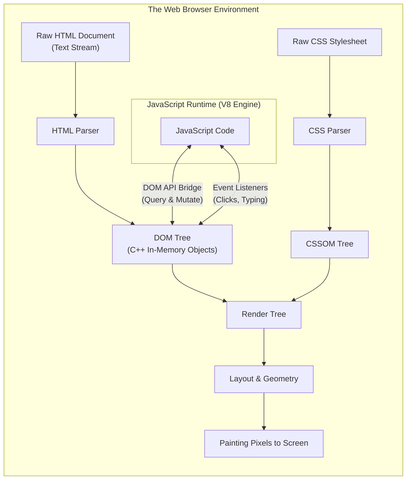
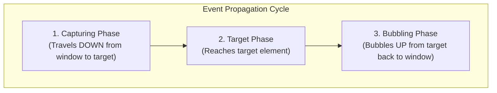

# Topic 13: The Document Object Model (DOM) & Interactivity

> **MAD-II Week 1 | Detailed Notes**

---

## Overview

Until now, our study of JavaScript has focused on the core language specification (**ECMAScript / ECMA-262**) — data types, operators, scoping rules, and execution patterns. In a pure JavaScript runtime (like Node.js or a command-line REPL), JavaScript has no concept of HTML pages, buttons, forms, or screens.

In the browser, however, JavaScript does not run in a vacuum. It is hosted inside a **Web Browser Environment** (Chrome, Firefox, Safari, Edge) that provides host-specific Web APIs. The most fundamental of these Web APIs is the **Document Object Model (DOM)**.

The DOM is the programmatic bridge that transforms static HTML documents into living, reactive, interactive web applications.



---

## 13.1 What is the DOM?

### The DOM as an Object-Oriented Tree Representation

When a web browser downloads an HTML document over HTTP, it receives a plain-text stream of characters:
```html
<!DOCTYPE html>
<html>
  <head><title>App</title></head>
  <body>
    <main>
      <h1 id="title">Welcome</h1>
      <p class="desc">Hello world</p>
    </main>
  </body>
</html>
```

The browser cannot directly compute styles, layout, or user clicks on a raw text string. It parses the HTML and constructs a **hierarchical tree of object nodes** in system memory. This tree is the **Document Object Model (DOM)**.

Every tag, attribute, and text snippet becomes a JavaScript-accessible **Node object**:

```
                 document (HTMLDocument)
                            │
                         <html>
                   ┌────────┴────────┐
                <head>             <body>
                   │                 │
                <title>            <main>
                   │           ┌─────┴─────┐
                "App"        <h1>         <p>
                               │           │
                          "Welcome"   "Hello world"
```

- In this tree, `<html>` is the parent of `<head>` and `<body>`.
- `<main>` is the child of `<body>` and the parent of `<h1>` and `<p>`.
- The actual text `"Welcome"` is a **Text Node** child of the `<h1>` **Element Node**.

---

### Separation: JavaScript Engine vs. Browser DOM APIs

It is a common beginner misconception that the DOM *is* JavaScript. **They are completely separate systems:**

1. **The JavaScript Engine (e.g., V8 in Chrome, SpiderMonkey in Firefox)**:
   - Responsible strictly for executing ECMAScript: allocating variables, managing the call stack, executing functions, and garbage-collecting heap memory.
   - Has **no native knowledge** of `window`, `document`, `<div>`, or mouse clicks.

2. **The Browser Web API / Rendering Engine (e.g., Blink, Gecko, WebKit)**:
   - Written in C++, responsible for network requests, HTML parsing, CSS style computation, layout calculation, and GPU screen rendering.
   - **Exposes the DOM to the JavaScript engine** by injecting global host objects (`window`, `document`) into JavaScript's execution context.

When you execute:
```javascript
const heading = document.getElementById("title");
heading.textContent = "New Title";
```
JavaScript is making a call across the **C++ Web API bridge**. The browser engine updates its in-memory C++ representation of that node, calculates if the screen layout changed (reflow), and repaints the pixels on the monitor.

---

### Node Types & The Node Hierarchy

In the DOM, everything is a `Node`, organized in an object-oriented inheritance hierarchy:

```
EventTarget
   └── Node
        ├── Document (e.g., window.document)
        ├── Element (HTML tags: <div>, <p>, <button>)
        │    ├── HTMLElement
        │    │    ├── HTMLInputElement
        │    │    ├── HTMLButtonElement
        │    │    └── HTMLAnchorElement
        ├── CharacterData
        │    └── Text (the string content inside tags)
        └── Comment (<!-- comments -->)
```

#### `Node` vs. `Element`:
- A **`Node`** is any entity in the DOM tree (including comments, whitespace line breaks, and text).
- An **`Element`** is specifically a Node that corresponds to an HTML tag (type `Node.ELEMENT_NODE`).

> [!TIP]
> This distinction explains why `element.childNodes` returns text nodes and whitespace, whereas `element.children` returns only actual HTML element tags. In 99% of web development tasks, you want **`element.children`**.

---

## 13.2 Selecting & Querying DOM Elements

Before you can interact with or mutate an HTML element, you must obtain a reference to its node in the DOM tree.

### The Modern Standard: `querySelector` and `querySelectorAll`

Modern JavaScript standardizes on CSS-selector-based querying via two methods available on `document` (or any individual `Element`):

#### 1. `document.querySelector(cssSelector)`
Returns the **first** Element within the document that matches the specified CSS selector string. If no matches are found, it returns `null`.

```javascript
// Selecting by ID:
const submitBtn = document.querySelector("#submit-button");

// Selecting by Class:
const alertBox = document.querySelector(".alert-warning");

// Selecting by Tag Name:
const firstParagraph = document.querySelector("p");

// Selecting by Attribute:
const emailInput = document.querySelector('input[type="email"]');

// Complex nested CSS selectors:
const activeNavItem = document.querySelector("nav.navbar ul > li.active > a");
```

#### 2. `document.querySelectorAll(cssSelector)`
Returns a static **`NodeList`** containing all elements that match the selector. If no matches are found, it returns an empty `NodeList` (`[]`).

```javascript
const allCards = document.querySelectorAll(".card");

console.log(`Found ${allCards.length} cards.`);

// NodeList supports forEach natively:
allCards.forEach((card, index) => {
    console.log(`Card ${index}:`, card);
});
```

---

### Legacy Query Methods vs. Modern Standards

Before `querySelector` was standardized in HTML5, developers relied on older DOM Level 1/2 methods:

| Method | Return Type | Live Collection? | Modern Recommendation |
| :--- | :--- | :---: | :--- |
| `document.getElementById("id")` | `Element` or `null` | N/A | Excellent and fast for unique IDs. |
| `document.getElementsByClassName("cls")` | `HTMLCollection` | **YES** | Avoid. Use `querySelectorAll(".cls")`. |
| `document.getElementsByTagName("p")` | `HTMLCollection` | **YES** | Avoid. Use `querySelectorAll("p")`. |
| `document.querySelector("css")` | `Element` or `null` | N/A | **Primary modern standard.** |
| `document.querySelectorAll("css")` | `NodeList` | **NO** (Static) | **Primary modern standard for multi-elements.** |

> [!CAUTION]
> **The Hazard of "Live" `HTMLCollection`s**:
> Methods like `getElementsByClassName` return a **live collection**. If you modify the DOM inside a loop iterating over a live collection, the collection updates *during* the loop, altering its length and indices dynamically! This causes infinite loops or skipped items.
> `querySelectorAll` returns a **static snapshot** `NodeList` that does not shift under your feet during iteration.

---

## 13.3 DOM Manipulation & Dynamic Outputs

### Why `console.log` is Insufficient for Real Web Apps
In backend development (or beginner tutorials), `console.log()` is used to display output. But end users do not open Browser Developer Tools (`F12`). 

In modern web development:
- **Input** comes from the user interacting with the DOM (typing, clicking, dragging).
- **Output** is rendered by mutating the DOM (updating text, showing modals, inserting table rows, animating progress bars).

---

### 1. Mutating Text Content: `textContent` vs. `innerHTML`

```javascript
const header = document.querySelector("#page-header");
```

#### `element.textContent` (Safe, Fast, Preferred):
Sets or retrieves the raw, unparsed text content of an element and all its descendants:
```javascript
header.textContent = "Welcome to MAD-II!"; 
```
- **Does NOT parse HTML tags**: Setting `header.textContent = "<b>Bold</b>"` displays the literal characters `<b>Bold</b>` on the screen.
- **Immune to Cross-Site Scripting (XSS)**: Safe for rendering untrusted user data.

#### `element.innerHTML` (Parses HTML, High Risk):
Sets or retrieves the HTML markup contained within the element:
```javascript
header.innerHTML = '<span class="highlight">Welcome to MAD-II!</span>';
```

> [!CAUTION]
> **CRITICAL SECURITY RISK: Cross-Site Scripting (XSS)**
> Never assign unsanitized user input directly to `innerHTML`. If an attacker inputs a malicious payload, the browser will execute their arbitrary JavaScript:
> ```javascript
> // VULNERABLE TO ATTACK:
> const userComment = '';
> commentBox.innerHTML = userComment; // The script in onerror RUNS!
> 
> // SAFE:
> commentBox.textContent = userComment; // Rendered harmlessly as plain text
> ```

---

### 2. Modifying Attributes & Properties

HTML attributes (written in HTML tags) map to properties on DOM objects:

```javascript
const profileImg = document.querySelector("#avatar");

// Direct property manipulation:
profileImg.src = "https://example.com/profile.png";
profileImg.alt = "User Profile Picture";

// Standard attribute methods:
profileImg.setAttribute("data-user-id", "10492");
console.log(profileImg.getAttribute("data-user-id")); // "10492"
profileImg.removeAttribute("loading");

// Form inputs:
const emailField = document.querySelector("#email-input");
emailField.value = "student@iitm.ac.in";
emailField.disabled = true; // Disables the input
```

#### Custom Data Attributes (`data-*`):
HTML5 allows custom data attributes prefixed with `data-`. JavaScript provides clean access via the `dataset` property (converting kebab-case to camelCase):
```html
<!-- HTML -->
<div id="product" data-product-id="99" data-category-type="electronics"></div>
```
```javascript
// JavaScript
const product = document.querySelector("#product");
console.log(product.dataset.productId);    // "99"
console.log(product.dataset.categoryType); // "electronics"
```

---

### 3. Mutating Styles and CSS Classes

#### A. Inline Styles via `element.style`
You can modify inline CSS styles directly using the `style` property. CSS property names with hyphens are converted to **camelCase**:

```javascript
const box = document.querySelector(".box");

box.style.backgroundColor = "#2563eb"; // CSS: background-color
box.style.fontSize = "18px";          // CSS: font-size
box.style.display = "none";           // Hides the element
```

#### B. Modern Standard: `element.classList`
Directly injecting inline styles with `element.style` mixes presentation with application logic, violating the **Separation of Concerns**.

The modern industry standard is to define styling in CSS classes, and use JavaScript's **`classList` API** to toggle them dynamically:

```css
/* style.css */
.card-active {
    border: 2px solid #2563eb;
    box-shadow: 0 4px 12px rgba(0,0,0,0.15);
}
.hidden {
    display: none;
}
```

```javascript
// script.js
const card = document.querySelector(".card");

// 1. Add a class:
card.classList.add("card-active");

// 2. Remove a class:
card.classList.remove("hidden");

// 3. Toggle a class (adds if absent, removes if present):
card.classList.toggle("card-active");

// 4. Check if a class exists:
if (card.classList.contains("card-active")) {
    console.log("Card is highlighted!");
}
```

---

### 4. Creating, Inserting & Removing DOM Nodes

You can dynamically build elements and inject them into the live DOM tree:

```javascript
// 1. Create a new element:
const newTodo = document.createElement("li");

// 2. Configure its content and attributes:
newTodo.textContent = "Complete MAD-II Week 1 Assignment";
newTodo.classList.add("todo-item");

// 3. Obtain target container:
const todoList = document.querySelector("#todo-list");

// 4. Append to container:
todoList.appendChild(newTodo); // Appends as the last child
// Alternatively, modern helper:
todoList.append(newTodo);      // Can append multiple elements and text strings!
todoList.prepend(newTodo);     // Inserts as the FIRST child

// 5. Removing an element:
newTodo.remove(); // Removes itself directly from the DOM!
```

---

## 13.4 Event-Driven Inputs & Interactivity

Web applications are fundamentally **event-driven**. Rather than executing a pre-planned procedural sequence, the browser sits idle in its event loop, waiting for user-initiated signals (clicks, keypresses, mouse movements, scrolling, window resizing).

---

### The Modern Standard: `addEventListener`

The W3C DOM Level 2 standard introduced `addEventListener()`, which allows one or more handler functions to listen for a specific event on a DOM node:

```javascript
targetElement.addEventListener(eventTypeString, callbackFunction);
```

```javascript
const actionButton = document.querySelector("#btn-action");

actionButton.addEventListener("click", () => {
    console.log("Button clicked!");
});
```

#### Why Inline HTML Event Handlers are an Anti-Pattern:
In ancient web development (1990s), handlers were written directly inside HTML tags:
```html
<!-- LEGACY ANTI-PATTERN: DO NOT USE -->
<button onclick="handleAction()">Click Me</button>
```
**Why this is prohibited in modern engineering**:
1. **Violates Separation of Concerns**: Mixes behavioral logic inside structural HTML.
2. **Global Scope Dependency**: `handleAction` must be attached to the global `window` object, breaking module encapsulation.
3. **Single Handler Limit**: You cannot attach multiple independent listeners to the same event.
4. **Security**: Blocked by strict **Content Security Policies (CSP)** in production environments.

---

### Common Event Categories

#### 1. Mouse Events
```javascript
const card = document.querySelector(".interactive-card");

card.addEventListener("click", () => console.log("Clicked"));
card.addEventListener("dblclick", () => console.log("Double clicked"));
card.addEventListener("mouseenter", () => card.classList.add("hovered"));
card.addEventListener("mouseleave", () => card.classList.remove("hovered"));
```

#### 2. Keyboard & Input Events
```javascript
const searchInput = document.querySelector("#search-box");

// 'input' event: Fires IMMEDIATELY on every keystroke, paste, or character deletion:
searchInput.addEventListener("input", (event) => {
    console.log("Current query:", event.target.value);
});

// 'keydown' event: Detects special keys (Enter, Escape, Arrows):
searchInput.addEventListener("keydown", (event) => {
    if (event.key === "Enter") {
        console.log("Searching for:", searchInput.value);
    }
});
```

#### 3. Form Events
```javascript
const registrationForm = document.querySelector("#register-form");

registrationForm.addEventListener("submit", (event) => {
    // CRITICAL: Stop the browser from executing default page refresh/navigation!
    event.preventDefault();

    const formData = new FormData(registrationForm);
    console.log("Form submitted via AJAX/fetch:", Object.fromEntries(formData));
});
```

---

### The `Event` Object

When an event fires, the browser automatically constructs an **`Event` object** and passes it as the first argument to the callback handler:

```javascript
button.addEventListener("click", function(event) {
    console.log(event.type);       // "click"
    console.log(event.target);     // The exact DOM element clicked
    console.log(event.timeStamp);  // Time when event occurred
});
```

#### Key Methods of the Event Object:
1. **`event.preventDefault()`**:
   Suppresses the browser's default native action associated with that event.
   - Prevents an HTML `<form>` from reloading the page on submit.
   - Prevents an `<a href="...">` link from navigating to a new URL.
   - Prevents a checkbox from toggling.

2. **`event.stopPropagation()`**:
   Stops the event from traveling further up or down the DOM tree.

---

### Event Propagation: Bubbling & Event Delegation

When an event occurs on a deeply nested element (e.g., clicking a `<span>` inside a `<button>` inside a `<div>`), the event does not just exist on that single element. It travels through the DOM hierarchy in **three phases**:



By default, all modern event listeners listen in the **Bubbling Phase** (the event bubbles upward like an air bubble in water, firing handlers on parent elements).

---

### The Event Delegation Pattern (Performance Architecture)

Imagine you have a dynamic list with 1,000 items, and you want to know when any item is clicked.

#### The Inefficient Approach:
Attaching 1,000 separate event listeners to 1,000 separate `<li>` elements wastes significant browser memory and fails when new items are added dynamically:
```javascript
// BAD: 1,000 separate listeners allocated in memory
document.querySelectorAll("li").forEach(item => {
    item.addEventListener("click", () => handleItemClick(item));
});
```

#### The Professional Approach (Event Delegation):
Attach **one single event listener** to the parent container (`<ul>`). Thanks to event bubbling, any click on an `<li>` bubbles up to the `<ul>`. Use **`event.target`** to identify which item was clicked:

```html
<ul id="task-list">
    <li data-id="1">Task One</li>
    <li data-id="2">Task Two</li>
    <li data-id="3">Task Three</li>
</ul>
```

```javascript
const taskList = document.querySelector("#task-list");

// Single listener handles unlimited items (even newly added ones!):
taskList.addEventListener("click", (event) => {
    // Check if the clicked element is an <li>
    const clickedItem = event.target.closest("li");

    if (clickedItem && taskList.contains(clickedItem)) {
        const taskId = clickedItem.dataset.id;
        console.log(`Task ${taskId} clicked!`);
        clickedItem.classList.toggle("completed");
    }
});
```

**Benefits of Event Delegation**:
1. **Dramatically Lower Memory Usage**: One listener instead of thousands.
2. **Automatic Support for Dynamic Elements**: If you append 50 new `<li>` elements later via JavaScript, the click handler works instantly without re-binding listeners!

---

## 13.5 Complete Interactive Application Example

Let's combine element selection, DOM creation, class toggling, event handling, and form prevention into a clean, working interactive component:

```html
<!DOCTYPE html>
<html lang="en">
<head>
    <meta charset="UTF-8">
    <title>Interactive Counter App</title>
    <style>
        .counter-box { font-family: sans-serif; padding: 20px; text-align: center; }
        .count-display { font-size: 48px; margin: 20px 0; font-weight: bold; }
        .negative { color: #dc2626; }
        .positive { color: #16a34a; }
        button { font-size: 18px; padding: 8px 16px; margin: 0 4px; cursor: pointer; }
    </style>
</head>
<body>
    <div class="counter-box">
        <h1>MAD-II Counter</h1>
        <div id="counter" class="count-display">0</div>
        <div>
            <button id="btn-decrement">- Decrement</button>
            <button id="btn-reset">Reset</button>
            <button id="btn-increment">+ Increment</button>
        </div>
    </div>

    <script>
        // 1. Obtain DOM node references:
        const counterDisplay = document.querySelector("#counter");
        const btnDecrement = document.querySelector("#btn-decrement");
        const btnReset = document.querySelector("#btn-reset");
        const btnIncrement = document.querySelector("#btn-increment");

        // 2. Application State:
        let count = 0;

        // 3. UI Render Function (syncs State -> DOM):
        function render() {
            counterDisplay.textContent = count;

            // Manage CSS classes dynamically:
            counterDisplay.classList.remove("positive", "negative");
            if (count > 0) {
                counterDisplay.classList.add("positive");
            } else if (count < 0) {
                counterDisplay.classList.add("negative");
            }
        }

        // 4. Attach Event Listeners:
        btnIncrement.addEventListener("click", () => {
            count++;
            render();
        });

        btnDecrement.addEventListener("click", () => {
            count--;
            render();
        });

        btnReset.addEventListener("click", () => {
            count = 0;
            render();
        });
    </script>
</body>
</html>
```

---

## Summary: Best Practices Checklist

| Practice | Recommended Approach | Anti-Pattern to Avoid |
| :--- | :--- | :--- |
| **Element Selection** | `document.querySelector()` / `querySelectorAll()` | Legacy `getElementsByClassName()` with live collections |
| **Updating Text** | `element.textContent` | `element.innerHTML` for plain text (prevents XSS vulnerabilities) |
| **Styling** | `element.classList.add() / toggle()` | Hardcoding inline styles via `element.style.cssText` |
| **Event Binding** | `element.addEventListener("click", handler)` | Inline HTML attributes (`onclick="..."`) |
| **Form Submissions** | Always invoke `event.preventDefault()` | Allowing form to trigger default HTTP page refresh |
| **Lists & Tables** | **Event Delegation** on container parent | Attaching hundreds of individual event listeners to children |
