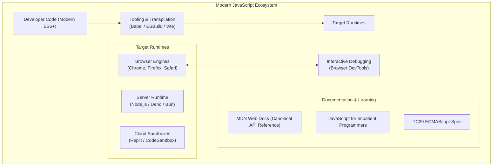
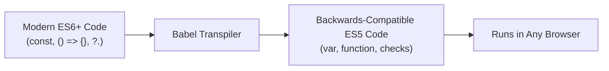

# Topic 14: References, Tooling & Ecosystem Utilities

> **MAD-II Week 1 | Detailed Notes**

---

## Overview

Modern web development is no longer about editing raw `.js` files in a basic text editor and manually refreshing a browser window. Today, JavaScript is supported by the **largest software ecosystem in human history**, comprising:
- Authoritative documentation platforms and learning resources
- Transpilers and polyfill engines that bridge language evolution across browser generations
- Advanced in-browser debugging suites (Developer Tools)
- Server-side runtimes (Node.js) and cloud development sandboxes

Mastering these tools and knowing where to find authoritative information allows developers to debug complex issues independently, write future-proof code, and build scalable web applications.



---

## 14.1 Recommended Reading & Documentation

In an ecosystem that moves as rapidly as JavaScript, relying on unverified blog posts or outdated tutorials (which often teach obsolete `var` patterns or deprecated DOM methods) is hazardous. The following resources represent the **gold standard of authoritative documentation**:

---

### 1. MDN Web Docs (Mozilla Developer Network)
🌐 [developer.mozilla.org](https://developer.mozilla.org/)

MDN is the **de facto canonical documentation** for the entire open web platform, maintained by Mozilla with contributions from Google, Microsoft, W3C, and thousands of open-source engineers.

#### Why MDN is Essential:
- **Accuracy & Currency**: MDN documentation is continuously updated to reflect the latest ECMAScript specifications and WHATWG browser standards.
- **Specification Cross-References**: Every MDN article links directly to the formal W3C or ECMA-262 specification section.
- **Interactive Playgrounds**: Code snippets can be run and edited directly in the browser.
- **BCD (Browser Compatibility Data)**: MDN includes comprehensive tables showing exactly which browser versions support a given feature across desktop and mobile.

```
┌────────────────────────────────────────────────────────────┐
│ HOW TO READ AN MDN ENTRY EFFICIENTLY:                      │
│                                                            │
│ 1. Syntax Block: Shows parameters, optional args, defaults │
│ 2. Return Value: Identifies exact data type returned       │
│ 3. Exceptions: Lists runtime errors (TypeError, etc.)      │
│ 4. Examples: Real-world idiomatic usage patterns           │
│ 5. Specifications: Links to formal standard                │
│ 6. Browser Compatibility Table: Safe for production?      │
└────────────────────────────────────────────────────────────┘
```

> [!TIP]
> **Search Shortcut**: When searching for any JavaScript or DOM topic, append `mdn` to your query (e.g., `array reduce mdn` or `addeventlistener mdn`) to go straight to authoritative documentation.

---

### 2. *JavaScript for Impatient Programmers*
✍️ **Dr. Axel Rauschmayer** | 🌐 [exploringjs.com/impatient-js/](https://exploringjs.com/impatient-js/)

This book is specifically engineered for programmers who **already know another programming language** (such as Python from MAD-I or C/Java):
- **Skips Elementary Basics**: Doesn't waste time explaining what an `if` statement or integer is; focuses immediately on JavaScript's unique mechanics.
- **Explains the "Why"**: Dives deeply into type coercion, lexical scoping, the event loop, and prototype chains.
- **ES6+ First**: Teaches modern JavaScript directly (`const`/`let`, arrow functions, classes, modules), treating pre-ES6 constructs (`var`, prototype hacks) strictly as historical context.

---

### 3. Learn JavaScript Online
🌐 [learnjavascript.online](https://learnjavascript.online/)

An interactive, test-driven learning platform created by Jad Joubran:
- Built around **micro-lessons** followed immediately by browser-evaluated automated coding challenges.
- Emphasizes modern functional methods (`map`, `filter`, `find`, `reduce`, async/await).
- Ideal for building muscle memory and rapid syntax recall.

---

### 4. The ECMAScript Specification (ECMA-262)
🌐 [tc39.es/ecma262/](https://tc39.es/ecma262/)

The official, binding technical standard maintained by the **TC39 committee**. While dense and academic, referring to the spec is the ultimate way to resolve contentious language debates (such as the exact algorithms for `Abstract Equality Comparison` or `ToPrimitive`).

---

## 14.2 Essential Utilities & Run-times

Modern web engineering relies on specific software tools to translate, execute, and debug code.

---

### 1. Compilers & Transpilers: BabelJS
🌐 [babeljs.io](https://babeljs.io/)

JavaScript is unusual among major languages because developers **do not control the runtime environment** where their code executes. Your code might run on a brand-new iPhone running Safari 17, or a budget Android phone running Chrome 80, or a corporate desktop locked to an older browser version.

If you write modern ES2024 code (using new syntax features like `??=`, optional chaining, or private class fields), older browsers that lack support will throw an unhandled `SyntaxError` and crash the application.



#### What Babel Does:
**Babel is a source-to-source JavaScript compiler (transpiler)**. It takes modern JavaScript code and converts it into backwards-compatible JavaScript that can execute in legacy browsers:

```javascript
// Modern Source Code (Input to Babel):
const square = x => x ** 2;
const name = user?.profile?.name ?? "Anonymous";

// Transpiled Output (Output from Babel for older runtimes):
var square = function (x) {
    return Math.pow(x, 2);
};
var _user$profile$name, _user$profile;
var name = (_user$profile$name = (_user$profile = user) === null || _user$profile === void 0 ? void 0 : _user$profile.name) !== null && _user$profile$name !== void 0 ? _user$profile$name : "Anonymous";
```

#### Transpilers vs. Polyfills:
- **Transpiler (e.g., Babel, SWC, ESBuild)**: Rewrites **syntax** that an older parser cannot read (transforms arrow functions into `function`, `class` into prototypes).
- **Polyfill (e.g., `core-js`)**: Implements missing **APIs and global objects** that do not exist in older runtimes (e.g., providing a fallback implementation of `Promise`, `fetch()`, or `Array.prototype.includes()`).

---

### 2. Interactive Evaluation: Browser Developer Tools (DevTools)

Every modern web browser includes an integrated suite of development and debugging utilities known as **DevTools** (opened via `F12` or `Ctrl + Shift + I` / `Cmd + Option + I`).

```
┌─────────────────────────────────────────────────────────────┐
│                   BROWSER DEVTOOLS PANELS                   │
├──────────────┬──────────────────────────────────────────────┤
│ Elements     │ Live DOM tree inspection and CSS debugging   │
├──────────────┼──────────────────────────────────────────────┤
│ Console      │ Interactive REPL, logging, error reporting   │
├──────────────┼──────────────────────────────────────────────┤
│ Sources      │ Source code viewer, breakpoints, step-debug  │
├──────────────┼──────────────────────────────────────────────┤
│ Network      │ HTTP requests, fetch/XHR, load timings       │
├──────────────┼──────────────────────────────────────────────┤
│ Application  │ LocalStorage, Cookies, SessionStorage, cache │
└──────────────┴──────────────────────────────────────────────┘
```

#### The Console Panel as a REPL:
The DevTools Console is a full **Read-Eval-Print Loop (REPL)** with live access to the current page's `window` and `document` objects:
- Press `Enter` to immediately evaluate any JavaScript expression.
- Press `Shift + Enter` to enter multi-line code blocks.

#### Secret DevTools Utility APIs:
The browser console injects helpful shorthand variables and functions:
- **`$0`**: References the element currently selected in the *Elements* panel.
- **`$$("selector")`**: Shorthand alias for `document.querySelectorAll("selector")`.
- **`$(":selector")`**: Shorthand alias for `document.querySelector("selector")`.
- **`console.table(arrayOrObject)`**: Formats array/object data into a beautiful, sortable visual table.
- **`console.time("label")` / `console.timeEnd("label")`**: High-precision benchmarking timer.
- **`debugger;` statement**: Writing `debugger;` in your JavaScript source code acts as a programmatic breakpoint, automatically pausing execution in the Sources panel if DevTools is open.

```javascript
// Example: Using console.table for debugging:
const users = [
    { id: 1, name: "Alice", role: "Admin" },
    { id: 2, name: "Bob", role: "Editor" },
    { id: 3, name: "Charlie", role: "Viewer" }
];

console.table(users); // Displays an interactive grid with columns: (index), id, name, role
```

---

### 3. Server-Side Execution: Node.js
🌐 [nodejs.org](https://nodejs.org/)

Created by Ryan Dahl in 2009, **Node.js** took Google's open-source **V8 JavaScript engine** out of the Chrome browser and embedded it into a standalone C++ application with native OS bindings.

#### Key Characteristics of Node.js:
- **JavaScript on the Server**: Allows developers to build backends, APIs, CLI tools, and automation scripts using JavaScript (unifying frontend and backend in one language).
- **Environment Differences**:
  - **In Browser**: Has `window`, `document`, DOM, and local UI events; lacks direct filesystem or raw network socket access for security.
  - **In Node.js**: Has **no** `window` or `document` (calling `document.querySelector` throws `ReferenceError`), but has direct access to the filesystem (`fs`), networking (`http`), OS processes (`process`), and native system threads.
- **NPM (Node Package Manager)**: The default package registry for Node.js, hosting over 2.5 million reusable open-source libraries.

```bash
# Running a JavaScript file in Node.js:
node server.js

# Starting an interactive Node CLI REPL:
node
```

---

### 4. Cloud & Sandbox Environments

For rapid experimentation, homework assignments, and bug reproductions without installing local software:

#### A. Replit (🌐 [replit.com](https://replit.com/))
- Provides full in-browser Linux virtual machines with Node.js, Python, Flask, and web preview capabilities.
- Ideal for testing full-stack MAD-I / MAD-II integration projects with live collaboration.

#### B. CodeSandbox & StackBlitz (🌐 [codesandbox.io](https://codesandbox.io/) / [stackblitz.com](https://stackblitz.com/))
- Purpose-built for modern frontend web applications (Vue.js, React, Vite).
- Emulates instant live development servers directly inside web browser WebWorkers with zero local installation.

---

## 14.3 The Modern Frontend Build Pipeline (Connecting to MAD-II)

As you progress through MAD-II (moving from raw JavaScript into Vue.js, component architectures, and multi-file SPAs), you will utilize the modern build pipeline:

```
┌─────────────────────────────────────────────────────────────┐
│               THE MODERN WEB BUILD PIPELINE                 │
│                                                             │
│   Source Code (.js, .vue, .css)                             │
│         │                                                   │
│         ▼                                                   │
│   Linter (ESLint)           -> Enforces code quality        │
│         │                                                   │
│         ▼                                                   │
│   Formatter (Prettier)      -> Enforces consistent styling  │
│         │                                                   │
│         ▼                                                   │
│   Bundler / Dev Server      -> Hot Module Replacement (HMR) │
│   (Vite / ESBuild)          -> Rapid local development      │
│         │                                                   │
│         ▼                                                   │
│   Production Minification   -> Bundles, tree-shakes,        │
│   & Optimization               and compresses assets        │
│         │                                                   │
│         ▼                                                   │
│   Deployable Bundle (dist/) -> Served by Nginx / Flask /    │
│                                Cloudflare / Netlify         │
└─────────────────────────────────────────────────────────────┘
```

- **ESLint**: Scans your code for potential errors, unused variables, and violations of best practices (like warning against `==` or `var`).
- **Prettier**: Automatically formats indentation, quotes, and commas to eliminate style debates.
- **Vite (French for "Fast")**: The next-generation frontend build tool created by Evan You (creator of Vue.js), leveraging native browser ES modules for lightning-fast development servers and optimized Rollup production builds.

---

## Summary Reference Table

| Tool / Resource | Category | Primary Purpose | URL |
| :--- | :--- | :--- | :--- |
| **MDN Web Docs** | Reference | The definitive standard for HTML, CSS, JS, and DOM APIs | [developer.mozilla.org](https://developer.mozilla.org/) |
| *JavaScript for Impatient Programmers* | Textbook | Comprehensive modern ES6+ guide for experienced programmers | [exploringjs.com](https://exploringjs.com/impatient-js/) |
| **Babel** | Compiler | Transpiles modern ESNext syntax to backwards-compatible ES5 | [babeljs.io](https://babeljs.io/) |
| **Browser DevTools** | Debugger | Live DOM manipulation, JS profiling, console REPL, breakpoints | Built into Browser (`F12`) |
| **Node.js** | Runtime | Server-side JavaScript execution and tooling foundation | [nodejs.org](https://nodejs.org/) |
| **Replit / CodeSandbox** | Sandbox | Zero-setup interactive cloud coding environments | [replit.com](https://replit.com/) |
| **Vite** | Build Tool | Modern dev server and bundling engine for Vue.js apps | [vitejs.dev](https://vitejs.dev/) |
