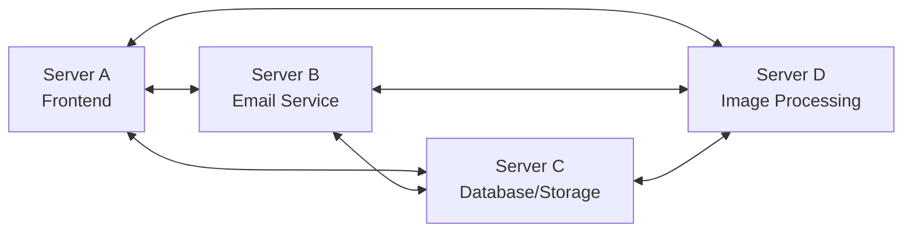
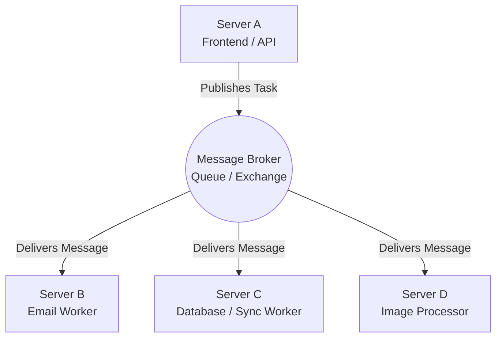
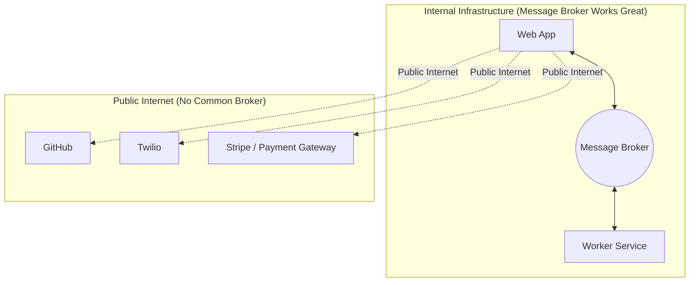

# Topic 01: Inter-Service Messaging & Message Queues Recap

---

## 1. Context & Motivation: Why Inter-Service Messaging?

In modern web applications, monolithic architectures are broken down into **microservices** or independent components (e.g., Frontend Web Server, Authentication Service, Background Workers, Email Notification Service, Database, and Media/Image Processing Service).

These independent components must communicate to complete business workflows. For example:
- A user uploads an avatar image $\rightarrow$ The frontend needs to notify the image processing service to generate thumbnails.
- An order is placed $\rightarrow$ Payment service, inventory service, and email confirmation service need to coordinate.

How these services talk to each other defines the **coupling**, **scalability**, and **reliability** of the system.

---

## 2. Evolution of Service Communication Architecture

### A. Point-to-Point Mesh (Direct Interconnection)

In an early or naive setup, every service directly initiates network connections (e.g., direct HTTP/RPC/TCP calls) to every other service it needs to communicate with.

#### Drawbacks of Direct Mesh:
1. **$O(N^2)$ Complexity**: For $N$ services, there can be up to $\frac{N(N-1)}{2}$ direct connections. Adding a single new service requires configuring and authenticating connections with many existing services.
2. **Tight Temporal & Spatial Coupling**: If Server B (Email) is temporarily down or overwhelmed, Server A (Frontend) blocks, fails, or has to implement its own retry logic and buffers.
3. **Cascading Failures**: Failures in downstream services propagate upstream, bringing down the entire application.
4. **Configuration Nightmare**: Managing firewall rules, service discovery, SSL certificates, and network topology across all pairs of servers is difficult.

---

### B. Centralized Message Broker Architecture

To solve the mesh problem, modern distributed systems introduce an intermediary abstraction: the **Message Broker** (e.g., RabbitMQ, Redis Streams, Celery with Redis/RabbitMQ broker, Apache Kafka).

#### Advantages of a Central Broker:
- **Decoupling (Star Topology)**: Each service only knows the broker’s address. Adding a new worker or service doesn't require touching any existing service code.
- **Load Leveling / Buffering**: If there is a sudden spike in requests (e.g., flash sale, bulk uploads), the message broker absorbs the spikes into queues without crashing worker servers.
- **Asynchronous Execution**: Producers push messages onto the queue and immediately return an acknowledgement to the user without waiting for the slow worker to finish.

---

## 3. Core Characteristics of Traditional Message Queues

Traditional message queues (typically implemented inside an internal private network or virtual private cloud) have distinct properties:

| Property | Description |
| :--- | :--- |
| **Co-location / Closely Related** | Services generally run inside the same data center, private subnet, or tightly integrated enterprise cluster. |
| **Close Coupling of Schemas** | Services usually share common data models, serialization protocols (Protobuf, JSON schemas, Avro), and trusted security boundaries. |
| **Asynchronous Delivery** | The sender does not wait for the consumer to finish processing; delivery is decoupled across time. |
| **Guarantees of Delivery** | Provides persistent message stores, acknowledgements (`ACK`), and retries with semantics like *at-least-once* or *exactly-once* delivery. |
| **Ordered Transactions** | Message brokers can enforce FIFO (First-In, First-Out) ordering within queues, ensuring chronological state transitions. |

### Typical Internal Use Cases
- **Email & Notification Dispatch**: Offloading user registration confirmation emails.
- **Media Transcoding**: Resizing user profile pictures, processing video uploads.
- **Data Warehousing & Analytics**: Streaming audit logs and user activity events to long-term storage.
- **Database Synchronization**: Propagating writes to secondary read-replicas or Elasticsearch indexes.

---

## 4. The Transition: What About Internet-Distributed Services?

Traditional message queues work smoothly within a **single organization's managed infrastructure**, but modern web ecosystems operate across the **public internet** between distinct, autonomous organizations:

### Why Message Brokers Fail on the Public Internet:
1. **No Common Message Broker**: Organization A (e.g., your app) and Organization B (e.g., GitHub or Stripe) cannot share a private RabbitMQ/Kafka cluster due to security, firewall, network isolation, and liability reasons.
2. **Public Endpoint Exposure**: Services across the internet communicate via standard public protocols, specifically **HTTP/HTTPS**.
3. **Relaxed Guarantees**: Delivery ordering or complex distributed transaction locks across third-party internet services are neither practical nor required.
4. **Need for Simplicity**: What is needed is **lightweight messaging** built on open, ubiquitous standards (like REST / HTTP POST callbacks).

---

## 5. Summary & Transition to Next Topic

- **Internal / Microservice Messaging** $\rightarrow$ Solved efficiently with **Message Queues / Brokers** (RabbitMQ, Redis, Celery).
- **Cross-Organization / Internet-Distributed Messaging** $\rightarrow$ Requires **Lightweight API Calls & Webhooks** using standard HTTP infrastructure.
