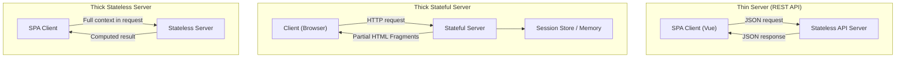
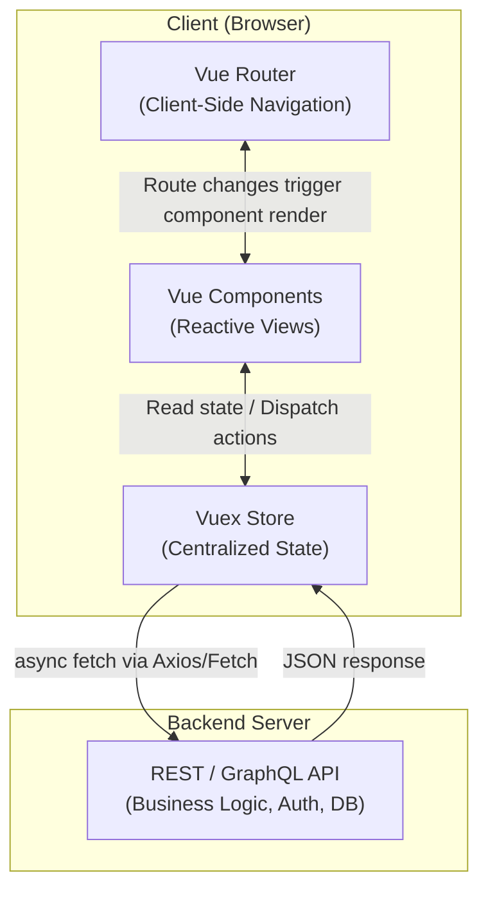
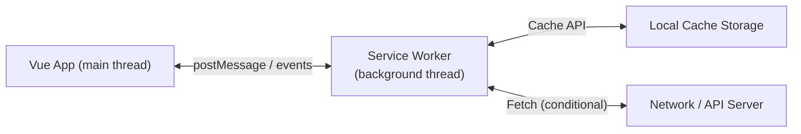
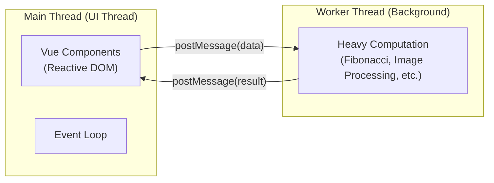

# Module 3: Single Page Applications (SPAs) & Modern Web Architecture

---

## 1. Traditional Web UX vs. SPA User Experience

### 1.1 The Multi-Page Application (MPA) Experience
Every user action that changes the page content in a traditional MPA follows the same painful cycle:

```
User Clicks Link
      │
      ▼
Browser sends HTTP GET to server
      │
      ▼
Server queries DB, builds full HTML response
      │
      ▼
Browser discards current page (white flash)
      │
      ▼
Browser parses new HTML, downloads CSS/JS again
      │
      ▼
New Page Renders (≈ 500ms – 3s of lost time per click)
```

**Key problems**:
- **White screen / Flash of Unstyled Content (FOUC)** on every navigation.
- **Re-downloading redundant resources**: The same header, navbar, footer scripts and stylesheets are re-evaluated on every page load.
- **Lost client state**: Shopping cart UI, scroll position, sidebar open/closed, in-progress form data — all wiped clean.
- **Poor perceived performance**: Even on fast connections, round-trip latency is noticeable.

### 1.2 The Single Page Application Experience
In an SPA, the browser loads the application **once**. All subsequent navigation is handled entirely by client-side JavaScript.

```
Initial Load (Once)
      │
      ▼
Browser downloads app shell (index.html + bundled JS/CSS)
      │
      ▼
Vue boots, mounts #app, Vue Router initializes
      │
      ▼
All future interactions handled by JS in memory

User Clicks "Profile" link
      │
      ▼
Vue Router intercepts → no HTTP request for HTML
      │
      ▼
Router swaps <router-view> component to Profile
      │
      ▼
Fetch API/Axios loads only JSON data needed
      │
      ▼
Vue reactively updates only the changed DOM nodes
```

### 1.3 Real-World SPA Examples
| Application | SPA Characteristic |
| :--- | :--- |
| **Gmail** | Reading/composing emails without full reload; background sync of new messages |
| **Google Maps** | Seamless pan/zoom; layer toggling; route searching without page reload |
| **Facebook / X (Twitter)** | Infinite scroll feeds; notifications; media playback continues during navigation |
| **Figma / draw.io** | Complex design canvas that would be impossible with MPAs |

---

## 2. Evolution & Technical Mechanisms of SPAs

### 2.1 Phase 1 — The Monolithic HTML Approach (Early 2000s)
The first attempts at "no-reload" pages involved loading *all possible content* upfront and toggling visibility with CSS:

```javascript
// Very early "SPA": hide/show entire sections
function showPage(pageId) {
  document.querySelectorAll('.page').forEach(p => p.style.display = 'none');
  document.getElementById(pageId).style.display = 'block';
}
```

**Problems**:
- The entire website HTML was transferred in one massive initial document.
- Enormous initial payload — even pages the user would never visit were downloaded.
- Not scalable beyond trivially small sites.

### 2.2 Phase 2 — The Plugin Era (2000s)
To work around HTML/JS limitations of that era, browsers relied on third-party plugins for rich interactive applications:

| Technology | Vendor | Demise |
| :--- | :--- | :--- |
| **Java Applets** | Sun / Oracle | Security vulnerabilities; high latency; poor mobile support |
| **Flash / ActionScript** | Macromedia → Adobe | No iOS support (Steve Jobs' 2010 letter); battery drain; deprecated 2020 |
| **Silverlight** | Microsoft | Abandoned in favour of HTML5 standards |

These plugins delivered rich interactive UIs but at the cost of security vulnerabilities, battery drain, heavy runtimes, and zero mobile compatibility.

### 2.3 Phase 3 — AJAX & the DOM Revolution (2005+)
**AJAX (Asynchronous JavaScript and XML)** — later using JSON rather than XML — was the true breakthrough. Introduced famously with Gmail (2004) and Google Maps (2005).

```javascript
// Classic XMLHttpRequest (pre-Fetch)
const xhr = new XMLHttpRequest();
xhr.open('GET', '/api/user/1');
xhr.onload = function() {
  const user = JSON.parse(xhr.responseText);
  document.getElementById('name').textContent = user.name;
};
xhr.send();
```

```javascript
// Modern Fetch API equivalent
fetch('/api/user/1')
  .then(res => res.json())
  .then(user => {
    document.getElementById('name').textContent = user.name;
  });
```

**The key idea**: Instead of asking the server for a new HTML page, ask only for the **data** in JSON and reconstruct only the relevant DOM nodes.

### 2.4 Phase 4 — Real-Time Streaming Protocols
For applications requiring live data (chat, trading dashboards, collaborative editors, live sports scores):

| Protocol | Direction | Use Case | Notes |
| :--- | :--- | :--- | :--- |
| **Short Polling** | Client → Server (repeated) | Checking for updates periodically | Wasteful; high server load |
| **Long Polling** | Client → Server (held) | Quasi-real-time notifications | Server holds response open until data arrives |
| **WebSockets** | Bidirectional | Chat, multiplayer games, collaborative tools | Full-duplex persistent TCP connection |
| **Server-Sent Events (SSE)** | Server → Client only | Live feeds, notifications, progress bars | Lightweight; works over standard HTTP; auto-reconnect |

```javascript
// WebSocket (bidirectional)
const ws = new WebSocket('wss://chat.example.com/socket');
ws.onmessage = (event) => {
  const msg = JSON.parse(event.data);
  appendChatMessage(msg);
};
ws.send(JSON.stringify({ text: 'Hello!' }));

// Server-Sent Events (server-to-client streaming)
const sse = new EventSource('/api/live-scores');
sse.onmessage = (event) => {
  updateScoreboard(JSON.parse(event.data));
};
```

---

## 3. Architectural Impact on the Backend Server

As SPAs shift all rendering responsibility to the client, the backend server's role fundamentally changes. There are three recognized architectural patterns:



### 3.1 Thin Server Architecture *(most common with SPAs)*
- The backend server provides only a **REST or GraphQL API** returning JSON payloads.
- The server is **stateless**: it stores no user session information between requests.
- All presentation logic — routing, rendering, validation feedback, UI state — lives in the client SPA.
- **Advantages**:
  - Extremely easy to scale horizontally (add more API server instances behind a load balancer).
  - API can be consumed by other clients too (mobile apps, IoT devices, third-party integrations).
- **Disadvantages**:
  - Initial page load requires downloading a JavaScript bundle before anything renders.
  - SEO is harder since crawlers may not execute JavaScript.

### 3.2 Thick Stateful Server Architecture
- The server **maintains user session state** in memory or a session store (e.g., Redis).
- The server produces **partial HTML fragments or JSON snippets** rather than full pages, which the client injects into the DOM.
- Technologies: HTMX, Hotwire/Turbo (Rails), traditional JSP sessions.
- **Advantages**:
  - Server has full context at all times; good for complex authorization logic.
- **Disadvantages**:
  - Horizontal scaling is difficult because sessions are tied to specific server instances (requires sticky sessions or shared session stores).
  - Tight coupling between server and client presentation.

### 3.3 Thick Stateless Server Architecture
- The client packages the **entire application context** (user ID, current state) into each request.
- The server reconstructs any necessary context purely from the request payload, applies business logic, and returns results — without storing anything between requests.
- Implemented commonly via **JWT (JSON Web Tokens)** containing user identity and permissions in a signed, self-contained token.
- **Advantages**:
  - Perfectly horizontal scaling; any server can handle any request.
  - No shared session storage required.
- **Disadvantages**:
  - Larger request payloads.
  - Token revocation is non-trivial.

---

## 4. Local Execution & Offline Web Storage

### 4.1 The `file://` Protocol
SPAs can be loaded directly from the local filesystem using the `file://` protocol rather than a web server:

```
file:///C:/Users/User/myapp/dist/index.html
```

Use cases:
- Offline kiosk applications.
- Packaged desktop apps via Electron.
- Development testing without a server.

> [!WARNING]
> **CORS Restrictions**: The `file://` protocol restricts cross-origin requests. Fetch API calls to external URLs may fail due to security policies unless the browser is launched with relaxed security flags.

### 4.2 Web Storage APIs

The browser provides three tiers of client-side data persistence:

| API | Storage Limit | Scope | Persistence | Access |
| :--- | :--- | :--- | :--- | :--- |
| **`localStorage`** | ~5–10 MB | Per origin (domain) | Persists indefinitely (until cleared) | Synchronous |
| **`sessionStorage`** | ~5–10 MB | Per tab per session | Cleared when tab is closed | Synchronous |
| **`IndexedDB`** | Hundreds of MB / GB | Per origin | Persists indefinitely | Asynchronous (Promise/Callback-based) |

```javascript
// localStorage — simple key-value persistence
localStorage.setItem('theme', 'dark');
const theme = localStorage.getItem('theme'); // 'dark'
localStorage.removeItem('theme');

// sessionStorage — tab-scoped ephemeral storage
sessionStorage.setItem('draftMessage', 'Hello world...');

// IndexedDB — structured, transactional, large-scale storage
const request = indexedDB.open('MyApp', 1);
request.onsuccess = (event) => {
  const db = event.target.result;
  // perform transactions here
};
```

### 4.3 Offline Cache & App Update Lifecycle
SPAs that implement Service Workers (see PWA section) can cache their application shell and assets:
1. **First Visit**: Browser downloads and installs the Service Worker; caches `index.html`, CSS, and JS bundles.
2. **Subsequent Visits (Online)**: Service Worker serves cached assets instantly; fetches only fresh data from network.
3. **Offline**: Service Worker serves entirely from cache; queues mutations to sync later.
4. **Update**: When a new version of the app is deployed, the Service Worker downloads the new bundle in the background and activates it on the next page load.

---

## 5. SPA Challenges & Trade-offs

### 5.1 Search Engine Optimization (SEO)

**The Problem**: Traditional web crawlers (Googlebot, Bingbot) historically only executed HTML fetched from the server. Since an SPA's content is generated dynamically by JavaScript at runtime, the crawler may see only:

```html
<!-- What the crawler sees without JS execution -->
<div id="app"></div>
```

Rather than the fully-rendered product listings, article text, or user profiles.

**Solutions**:
| Approach | How It Works | Trade-off |
| :--- | :--- | :--- |
| **Server-Side Rendering (SSR)** | Server pre-renders Vue components to HTML strings per request (e.g., Nuxt.js) | Increased server complexity and CPU load |
| **Static Site Generation (SSG)** | Pre-renders all pages to static HTML at build time (e.g., Nuxt `generate`) | Only viable for content that doesn't require real-time personalization |
| **Pre-rendering** | A headless browser visits routes at build time and saves the HTML snapshots | Works for small finite sets of routes |
| **Dynamic Rendering** | Serve a crawler-specific server-rendered version, serve the SPA to browsers | Requires maintaining two rendering pipelines |

### 5.2 Browser History Management
The browser's back/forward navigation must remain intuitive in an SPA:
- **Hash Mode** (`/#/route`): Changes to the hash portion of the URL never trigger HTTP requests, making it the safest default.
- **HTML5 History Mode**: Uses `history.pushState()` to manipulate the URL without reload. Requires server-side fallback.
- **Deep-Linking**: Sharing or bookmarking a specific route (e.g., `https://app.com/user/42/orders`) must produce the correct view when loaded directly — requiring the server to serve `index.html` for all paths and letting Vue Router re-initialize to the correct view.

### 5.3 Analytics & Telemetry
Traditional analytics (e.g., Google Analytics UA) track page views via the browser's `pageload` event. Since SPAs trigger no `pageload` on navigation:

```javascript
// Manual page view tracking in Vue Router navigation guard
router.afterEach((to, from) => {
  // Manually send a virtual pageview event to analytics
  window.gtag('event', 'page_view', {
    page_title: document.title,
    page_path: to.fullPath
  });
});
```

---

## 6. The Full Vue SPA Architecture

A complete production Vue SPA combines all three pillars:



| Layer | Technology | Responsibility |
| :--- | :--- | :--- |
| **Presentation** | Vue Components + Templates | Render reactive UI from state |
| **Navigation** | Vue Router | Map URL paths to component views; manage browser history |
| **State** | Vuex Store | Single source of truth; actions handle async; mutations update state |
| **API Communication** | Axios / Fetch API | HTTP requests to backend; JWT auth headers |
| **Backend** | Flask / Node.js / Django | Business validation, DB persistence, authentication, REST/GraphQL endpoints |

---

## 7. Progressive Web Apps (PWAs)

### 7.1 SPA vs. PWA — Clearing the Confusion

> [!IMPORTANT]
> **SPA and PWA are independent concepts that can overlap.** An SPA is an *architectural pattern* about how content is rendered. A PWA is a *set of browser capabilities* that make web apps behave like native apps. You can have:
> - An SPA that is **not** a PWA (no offline support, no install prompt).
> - A PWA that is **not** an SPA (multi-page app with a Service Worker).
> - An SPA that **is** a PWA (most modern Vue apps aim for this).

### 7.2 The Three Core PWA Requirements

To qualify as a PWA (and receive the browser "Add to Home Screen" / "Install" prompt):

1. **Served over HTTPS** (or `localhost` for development).
2. **Web App Manifest** (`manifest.json`) present and linked.
3. **Service Worker** registered.

### 7.3 Web App Manifest (`manifest.json`)
The manifest provides metadata that tells the browser how to present the app when installed:

```json
{
  "name": "My Vue App",
  "short_name": "VueApp",
  "start_url": "/",
  "display": "standalone",
  "background_color": "#ffffff",
  "theme_color": "#4DBA87",
  "icons": [
    {
      "src": "/img/icons/android-chrome-192x192.png",
      "sizes": "192x192",
      "type": "image/png"
    },
    {
      "src": "/img/icons/android-chrome-512x512.png",
      "sizes": "512x512",
      "type": "image/png"
    }
  ]
}
```

- `"display": "standalone"` removes the browser navigation chrome; the app looks and feels like a native app.
- `"start_url"` defines which route opens when the app is launched from the home screen icon.

### 7.4 Service Workers
A Service Worker is a JavaScript file that runs in a **background thread** entirely separate from the main browser page. It acts as a programmable network proxy between the web page and the internet.



**Capabilities**:
- **Offline caching**: Intercept `fetch` requests and serve from cache when offline.
- **Background Sync**: Queue failed API mutations (e.g., a form submission while offline) and retry when connectivity is restored.
- **Push Notifications**: Receive push messages from the server even when the browser tab is closed.
- **Periodic Background Sync**: Pre-fetch fresh content while the app is not actively open.

```javascript
// Registering a service worker in main.js
if ('serviceWorker' in navigator) {
  window.addEventListener('load', () => {
    navigator.serviceWorker.register('/service-worker.js')
      .then(reg => console.log('SW registered:', reg.scope))
      .catch(err => console.error('SW registration failed:', err));
  });
}
```

### 7.5 WebAssembly (Wasm) in PWAs
- **WebAssembly** is a low-level binary instruction format that runs in the browser at near-native speed.
- Languages like C, C++, Rust, and Go can be compiled to `.wasm` and loaded by JavaScript.
- Enables computationally intensive tasks in the browser: image/video processing, 3D physics simulations, cryptography, complex spreadsheet calculations.
- **Case Study**: `app.diagrams.net` (formerly draw.io) — a production PWA that handles complex vector graph rendering entirely in the browser, works offline, and can be installed as a desktop application.

---

## 8. Multithreading with Web Workers

### 8.1 JavaScript's Single-Threaded Limitation
JavaScript, by design, runs in a **single-threaded event loop**. Only one piece of code can execute at a time. Long-running synchronous operations block the thread, causing the UI to freeze:

```javascript
// This freezes the browser tab for several seconds:
function computeFibonacci(n) {
  if (n <= 1) return n;
  return computeFibonacci(n - 1) + computeFibonacci(n - 2);
}
const result = computeFibonacci(45); // UI completely frozen for ~5s
```

### 8.2 Web Workers: True Background Threads
Web Workers allow CPU-intensive code to run in a completely **separate OS thread**, keeping the main UI thread free to respond to user input:



#### Main Thread (app.js):
```javascript
// Create a Web Worker from a separate JS file
const worker = new Worker('/workers/fibonacci-worker.js');

// Send data to the worker
worker.postMessage({ n: 45 });

// Receive result asynchronously (UI remains responsive)
worker.onmessage = (event) => {
  console.log('Fibonacci result:', event.data.result);
  // Update Vue component with result
};
```

#### Worker Thread (fibonacci-worker.js):
```javascript
// Web Workers have no access to DOM or Vue instance
self.onmessage = (event) => {
  const n = event.data.n;
  const result = fibonacci(n); // May take several seconds
  self.postMessage({ result });
};

function fibonacci(n) {
  if (n <= 1) return n;
  return fibonacci(n - 1) + fibonacci(n - 2);
}
```

### 8.3 Web Workers in SPAs — Practical Roles
| Role | Example |
| :--- | :--- |
| **Heavy computation** | Parsing large CSV/JSON files, Fibonacci, matrix operations |
| **Background data fetching** | Pre-fetching next page content while user reads current page |
| **Compression / Encryption** | Gzip, AES — intensive but non-UI operations |
| **Service Workers** | Special type of Web Worker for caching and push (runs persistently) |

> [!NOTE]
> **Restrictions**: Web Workers cannot access the DOM, `window`, `document`, or Vue component instances. They communicate exclusively via message passing (`postMessage` / `onmessage`).

---

## 9. Architectural Comparison: Web Apps vs. Native Apps

### 9.1 Native Applications

| Platform | Primary Language(s) | SDK |
| :--- | :--- | :--- |
| iOS / macOS | Swift, Objective-C | UIKit / SwiftUI |
| Android | Kotlin, Java | Android SDK |
| Cross-platform | Dart | Flutter |
| Cross-platform | C# | .NET MAUI / Xamarin |

**Advantages of Native**:
- Direct access to all OS and hardware APIs (camera, GPS, accelerometer, Bluetooth, NFC, biometrics).
- Maximum rendering performance using platform-native UI components.
- Background execution capabilities without browser sandboxing restrictions.
- Better integration with system features (widgets, lock screen, notifications, shortcuts).

**Disadvantages of Native**:
- **Per-platform development**: An iOS app and an Android app typically require separate codebases, teams, and expertise.
- **App Store distribution**: Must submit to review; updates can take days to approve.
- **Installation friction**: Users must navigate to an app store, download, and install.

### 9.2 Modern Web Applications

**Advantages of Web**:
- **Write once, reach everywhere**: A single Vue.js codebase runs in every modern browser (desktop, mobile, tablet).
- **Zero installation**: Users navigate to a URL — no download, no install, no review process.
- **Instant updates**: Deploy a new version; every user gets it immediately on next visit.
- **Open standards**: HTML, CSS, and JavaScript are open, governed by the W3C and TC39 — no vendor lock-in.
- **Discoverability**: URLs are shareable, indexable, and deep-linkable.

**Disadvantages of Web**:
- **API coverage gap**: Until recently, native hardware features (camera, NFC, Bluetooth, File System) were inaccessible.
- **Performance ceiling**: V8/SpiderMonkey JavaScript engines are fast but not as fast as compiled native code for intensive tasks (mitigated by WebAssembly).

### 9.3 The Convergence of Web and Native

The gap between web and native is narrowing dramatically:

| Modern Web API | Native Equivalent |
| :--- | :--- |
| **PWA / Service Worker** | Background execution, offline, push notifications |
| **WebAssembly** | Near-native computation speed |
| **WebGL / WebGPU** | GPU-accelerated 3D rendering |
| **Web Bluetooth API** | Bluetooth peripheral communication |
| **Web USB API** | USB device communication |
| **Web NFC** | NFC tag reading (Android Chrome) |
| **File System Access API** | Read / write to local file system |
| **Screen Wake Lock API** | Prevent screen from sleeping |

---

## Summary & Exam Key Points

1. **SPA Core Idea**: Load once, navigate without page reloads; fetch only JSON data for updates.
2. **Evolution**: Monolithic HTML → Flash/Plugins → AJAX → WebSockets/SSE.
3. **Server Architectures**:
   - **Thin Server**: Stateless JSON API only (best scalability, most common with Vue).
   - **Thick Stateful**: Server holds sessions (hard to scale horizontally).
   - **Thick Stateless**: Client sends full context per request (JWT pattern).
4. **Web Storage Tiers**: `localStorage` (permanent) > `sessionStorage` (tab-scoped) > `IndexedDB` (large structured).
5. **SPA Challenges**: SEO (crawlers can't run JS), History Management (deep-links need server fallback), Analytics (no `pageload` events).
6. **SPA ≠ PWA**: They are independent. A PWA adds: HTTPS + Manifest + Service Worker.
7. **Service Workers**: Background thread; network proxy; enables offline caching, push notifications, background sync.
8. **WebAssembly**: Compile C/C++/Rust to near-native binary; runs in browser; used for compute-heavy tasks.
9. **Web Workers**: Offload CPU-intensive tasks to a background thread to avoid freezing the UI event loop.
10. **Web vs. Native**: Web = write once, zero install, instant deploy; Native = hardware API access, best performance. Gap rapidly closing via modern Web APIs.
