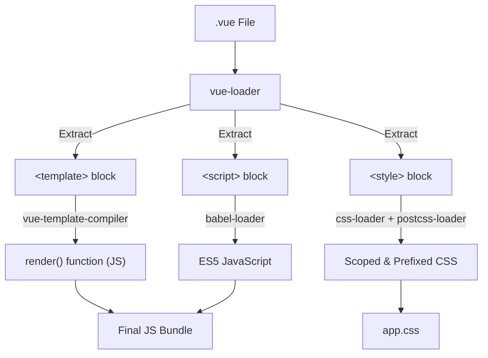
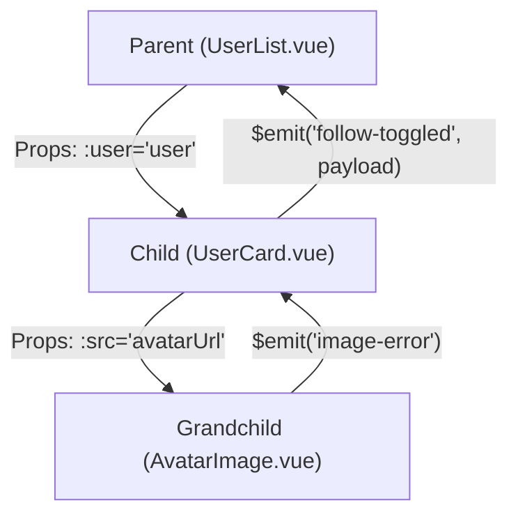

# Module 4: Vue CLI & Single File Components (SFCs)



## Learning objectives

By the end of this topic, you should be able to:

- Explain the main ideas covered in **Module 4: Vue CLI & Single File Components (SFCs)**.
- Connect these ideas to modern web application development.
- Recognize the patterns, terminology, and trade-offs used in practice.

---

## 1. Motivation — Why Not Just Use CDN / Script Tags?

### 1.1 How Vue Is Used Without a Build Tool
In its simplest form, Vue can be loaded as a plain CDN script tag in an HTML file:

```html
<!-- CDN / In-browser setup -->
<script src="https://cdn.jsdelivr.net/npm/vue@2/dist/vue.js"></script>
<script>
  const app = new Vue({
    el: '#app',
    template: `<div>{{ message }}</div>`,
    data() {
      return { message: 'Hello, World!' };
    }
  });
</script>
```

This approach is perfectly valid for quick prototypes, demos, or tiny widgets. But it breaks down immediately at any real application scale.

### 1.2 Specific Limitations of the CDN / String-Template Approach

| Problem | Explanation |
| :--- | :--- |
| **Runtime compilation overhead** | When templates are written as strings, Vue must ship its full compiler to the browser (`vue.js` vs `vue.runtime.js`). The compiler is ~30% of Vue's total bundle weight. It runs in the user's browser on every page load, consuming CPU time. |
| **No editor intelligence** | String templates are just JavaScript strings. IDEs cannot provide syntax highlighting, autocompletion, or error detection inside them. A typo in a directive is invisible until runtime. |
| **No CSS encapsulation** | CSS written inside `<style>` tags or separate files is globally scoped. `.button { }` in one component unintentionally affects `.button` elements in every other component — causing unpredictable style leakage. |
| **No preprocessor support** | Cannot use TypeScript, SASS, LESS, or PostCSS without a build step. |
| **No module system** | Without a bundler, you cannot use `import` / `export` ES modules natively across files in a manageable way. Code must be split across multiple `<script>` tags with carefully ordered loading. |
| **No code splitting or tree-shaking** | The entire Vue library and all component code is downloaded on initial load, even if 80% of it is for pages the user will never visit. |

### 1.3 The Modern Tooling Ecosystem

A production Vue application relies on the following tools:

```
Developer writes .vue files
          │
          ▼
    Node.js Runtime         ← Provides JS execution environment outside browser
          │
          ▼
  npm / yarn / pnpm         ← Package managers (install Vue, vue-loader, Webpack, etc.)
          │
          ▼
  Webpack / Vite            ← Module bundler that processes all assets
    ├── vue-loader          ← Parses .vue files → template, script, style blocks
    ├── babel-loader        ← Transpiles ES6+ → ES5 for older browsers
    ├── css-loader          ← Processes CSS imports
    └── postcss-loader      ← Applies scoped CSS attribute hashing, autoprefixing
          │
          ▼
  /dist/                    ← Optimized production output
    ├── index.html
    ├── app.bundle.js       ← Minified, tree-shaken JavaScript
    └── app.css             ← Extracted, purged CSS
```

---

## 2. Vue CLI — Overview & Project Scaffolding

### 2.1 What Is Vue CLI?
**Vue CLI** (`@vue/cli`) is the official command-line interface for Vue.js. It provides:
- **Instant scaffolding** of fully-configured projects with zero manual Webpack/Babel configuration.
- **Interactive preset selection** to pick features relevant to your project.
- **Plugin architecture** allowing features to be added/removed cleanly at any time.
- **GUI dashboard** (`vue ui`) for a browser-based project management interface.

The CLI has two main packages:
- **`@vue/cli`**: The global CLI tool you install once.
- **`@vue/cli-service`**: Installed per-project; wraps Webpack and provides `serve`, `build`, and `lint` commands.

### 2.2 Installing and Creating a Project

```bash
# Install Vue CLI globally (once per machine)
npm install -g @vue/cli

# Verify installation
vue --version

# Create a new project
vue create my-app
```

The interactive wizard prompts you to select features:

```
? Please pick a preset:
  ❯ Default ([Vue 2] babel, eslint)
    Default (Vue 3) ([Vue 3] babel, eslint)
    Manually select features

# Manually selecting features gives you:
? Check the features needed for your project:
  ◉ Babel
  ◉ TypeScript
  ◉ Progressive Web App (PWA) Support
  ◉ Router
  ◉ Vuex
  ◉ CSS Pre-processors
  ◉ Linter / Formatter
  ◉ Unit Testing
  ◉ E2E Testing
```

### 2.3 The `package.json` Scripts

Once created, your project's `package.json` provides these npm scripts:

```json
{
  "scripts": {
    "serve": "vue-cli-service serve",   // Starts dev server with HMR at localhost:8080
    "build": "vue-cli-service build",   // Produces optimised /dist bundle for production
    "lint":  "vue-cli-service lint"     // Runs ESLint across all source files
  }
}
```

```bash
npm run serve    # Start development server
npm run build    # Build for production
npm run lint     # Fix linting errors
```

---

## 3. Canonical Vue CLI Project Structure

After running `vue create my-app`, the following directory structure is generated:

```
my-app/
├── public/
│   ├── index.html          ← Shell HTML: <div id="app"></div> is the mount target
│   └── favicon.ico
│
├── src/
│   ├── main.js             ← App entry: imports Vue, App.vue, router, store → mounts
│   ├── App.vue             ← Root SFC: houses <router-view>, global nav, layout
│   │
│   ├── components/         ← Reusable, generic, atomic UI components
│   │   └── BaseButton.vue
│   │   └── AppNavbar.vue
│   │
│   ├── views/              ← Route-level page components (one per route)
│   │   ├── Home.vue
│   │   ├── About.vue
│   │   └── UserProfile.vue
│   │
│   ├── router/
│   │   └── index.js        ← VueRouter instance: route definitions & config
│   │
│   ├── store/
│   │   └── index.js        ← Vuex Store instance: state, getters, mutations, actions
│   │
│   └── assets/             ← Static resources processed by Webpack (images, fonts)
│       └── logo.png
│
├── .eslintrc.js            ← Linter configuration
├── babel.config.js         ← Babel transpiler configuration
├── vue.config.js           ← Optional: Webpack/devServer overrides
└── package.json            ← Dependencies, scripts, metadata
```

### Role of Each Key File

| File / Directory | Purpose |
| :--- | :--- |
| `public/index.html` | The HTML shell. Contains `<div id="app"></div>` — the mount point for the entire Vue application. Never put content here directly. |
| `src/main.js` | Entry point. Imports Vue, App.vue, router, and store; creates the root Vue instance and mounts it to `#app`. |
| `src/App.vue` | The root SFC. Defines the top-level layout: persistent navigation, footer, and the `<router-view/>` viewport where page components render. |
| `src/components/` | Small, reusable components that are not directly tied to routes (e.g., `BaseInput.vue`, `AppModal.vue`). |
| `src/views/` | Larger page-level components, each corresponding to a URL route (e.g., `/home` → `Home.vue`). |
| `src/router/index.js` | Configures and exports the VueRouter instance with all route definitions. |
| `src/store/index.js` | Configures and exports the Vuex store with state, getters, mutations, and actions. |

---

## 4. Structure & Syntax of a Single File Component (`.vue`)

A **Single File Component** is a custom file format (`.vue`) that co-locates the template, logic, and styles of a component into one cohesive, self-contained unit.

### 4.1 The Three-Block Architecture

```
┌─────────────────────────────────────────────┐
│                                             │
│   <template>                                │
│     HTML markup + Vue directives            │
│   </template>                               │
│                                             │
│   <script>                                  │
│     export default {                        │
│       name, props, data, computed,          │
│       methods, watch, lifecycle hooks       │
│     }                                       │
│   </script>                                 │
│                                             │
│   <style scoped>                            │
│     /* CSS scoped to this component only */ │
│   </style>                                  │
│                                             │
└─────────────────────────────────────────────┘
```

### 4.2 Complete Annotated Example

```html
<!-- src/components/UserCard.vue -->

<!-- ════════════ TEMPLATE BLOCK ════════════ -->
<template>
  <!-- Vue 2: Must have exactly ONE root element -->
  <div class="user-card">

    

    <div class="user-info">
      <h3>{{ user.name }}</h3>
      <p>{{ user.email }}</p>
      <span class="badge" :class="{ active: user.isActive }">
        {{ user.isActive ? 'Active' : 'Inactive' }}
      </span>
    </div>

    <button class="follow-btn" @click="handleFollow">
      {{ isFollowing ? 'Unfollow' : 'Follow' }}
    </button>

  </div>
</template>

<!-- ════════════ SCRIPT BLOCK ════════════ -->
<script>
export default {
  // Component identity (shows in Vue Devtools)
  name: 'UserCard',

  // Data received from parent component
  props: {
    user: {
      type: Object,
      required: true
    }
  },

  // Local reactive state — MUST be a function returning a fresh object
  data() {
    return {
      isFollowing: false
    };
  },

  // Derived, cached values computed from state/props
  computed: {
    avatarUrl() {
      return this.user.avatar || `https://ui-avatars.com/api/?name=${this.user.name}`;
    }
  },

  // Methods triggered by events or called programmatically
  methods: {
    handleFollow() {
      this.isFollowing = !this.isFollowing;
      // Notify parent component of the change
      this.$emit('follow-toggled', {
        userId: this.user.id,
        isFollowing: this.isFollowing
      });
    }
  },

  // Lifecycle hooks
  created() {
    console.log('UserCard created for:', this.user.name);
  },
  mounted() {
    console.log('UserCard mounted to DOM for:', this.user.name);
  },
  beforeDestroy() {
    console.log('UserCard about to be removed from DOM');
  }
};
</script>

<!-- ════════════ STYLE BLOCK ════════════ -->
<style scoped>
/* Styles here ONLY apply to elements in THIS component's template */
.user-card {
  display: flex;
  align-items: center;
  padding: 16px;
  border: 1px solid #e0e0e0;
  border-radius: 8px;
  gap: 16px;
}

.avatar {
  width: 64px;
  height: 64px;
  border-radius: 50%;
  object-fit: cover;
}

.badge {
  font-size: 0.75rem;
  padding: 2px 8px;
  border-radius: 12px;
  background: #f5f5f5;
  color: #888;
}

.badge.active {
  background: #e8f5e9;
  color: #2e7d32;
}

.follow-btn {
  margin-left: auto;
  padding: 8px 16px;
  border: 1px solid #1976d2;
  border-radius: 4px;
  background: transparent;
  color: #1976d2;
  cursor: pointer;
  transition: all 0.2s;
}

.follow-btn:hover {
  background: #1976d2;
  color: white;
}
</style>
```

### 4.3 The `data()` Function Rule — Critical Gotcha

> [!WARNING]
> In a component (as opposed to the root Vue instance), `data` **must always be a function** that returns a **new object**, never a plain object literal.

```javascript
// ❌ WRONG — plain object (only valid for the root Vue instance)
data: {
  count: 0
}

// ✅ CORRECT — function returning new object
data() {
  return {
    count: 0
  };
}
```

**Why?** When a component is reused multiple times, Vue creates separate instances of it. If `data` were a shared object reference, all instances would share the same state — mutating one would corrupt all others.

```
          SharedObject ← (WRONG: all 3 cards point to same data)
         /     |      \
  Card1      Card2    Card3

  FreshObject1    ← (CORRECT: each card gets its own isolated data)
  FreshObject2
  FreshObject3
```

---

## 5. Scoped CSS & Style Encapsulation

### 5.1 The Global CSS Problem

Without scoping, CSS written for one component bleeds into all others:

```html
<!-- ComponentA.vue -->
<style>
  .button { background: blue; }
</style>

<!-- ComponentB.vue — its buttons are ALSO blue, unintentionally! -->
<template>
  <button class="button">Click Me</button>
</template>
```

### 5.2 The `<style scoped>` Solution

Adding the `scoped` attribute to the `<style>` block restricts all CSS rules to **only the elements rendered by that component's template**:

```html
<style scoped>
  .button { background: blue; }
</style>
```

### 5.3 How Scoped CSS Works Under the Hood (PostCSS)

`vue-loader` uses PostCSS to transform scoped styles at build time via a two-step process:

**Step 1**: Every HTML element in the template gets a unique auto-generated attribute:
```html
<!-- Compiled template output (you never see this directly): -->
<div class="user-card" data-v-7ba5bd90>
  <button class="follow-btn" data-v-7ba5bd90>Follow</button>
</div>
```

**Step 2**: Every CSS selector in the `<style scoped>` block gets the attribute appended as an attribute selector:
```css
/* What you write: */
.follow-btn { background: #1976d2; }

/* What PostCSS compiles it to: */
.follow-btn[data-v-7ba5bd90] { background: #1976d2; }
```

The result: `.follow-btn` from `ComponentA` targets `.follow-btn[data-v-7ba5bd90]`, which will **never match** a `.follow-btn` element in `ComponentB` (which would carry a different hash like `data-v-3c45f1ab`).

### 5.4 Deep Selectors — Reaching Into Child Components

Because scoped styles don't penetrate child component boundaries, you sometimes need to style elements inside a child component (e.g., third-party UI library elements). Use the **deep selector**:

```html
<style scoped>
  /* Target .el-input__inner inside a child component (e.g., ElementUI) */

  /* Vue 2 — three syntaxes, all equivalent: */
  .parent-wrapper >>> .child-element { color: red; }
  .parent-wrapper /deep/ .child-element { color: red; }
  .parent-wrapper ::v-deep .child-element { color: red; }

  /* Vue 3 — modern syntax: */
  .parent-wrapper :deep(.child-element) { color: red; }
</style>
```

### 5.5 Global Styles Alongside Scoped Styles
You can have both a global `<style>` block and a scoped one in the same component:

```html
<!-- Global rules go in unscoped block -->
<style>
  body { font-family: 'Inter', sans-serif; }
  * { box-sizing: border-box; }
</style>

<!-- Component-specific rules in scoped block -->
<style scoped>
  .user-card { padding: 16px; }
</style>
```

---

## 6. Under the Hood: The Compilation Pipeline & `vue-loader`

### 6.1 What Does `vue-loader` Do?

`vue-loader` is a Webpack loader that allows Webpack to understand `.vue` files. Webpack natively only understands `.js`. When Webpack encounters an `import` of a `.vue` file, `vue-loader` takes over:



### 6.2 Ahead-of-Time (AOT) Template Compilation

Vue has two builds:
- **Full Build** (`vue.js`): Includes both the **runtime** and the **template compiler**. Templates (strings) are compiled in the browser. ≈ 30% larger.
- **Runtime-Only Build** (`vue.runtime.js`): Only includes the runtime renderer. Templates must already be compiled to render functions before reaching the browser.

When you use `.vue` files with `vue-loader`, templates are **compiled at build time** (AOT) into optimized `render()` functions. This means:

1. **No compiler shipped to the browser**: Production bundles use the smaller runtime-only build.
2. **Better performance**: Template compilation is a one-time build-time cost, not a per-user runtime cost.
3. **CSP compliance**: The runtime-only build avoids `eval()` and `new Function()`, which are forbidden by strict Content Security Policies.

```javascript
// What you write in <template>:
// <div class="card">{{ title }}</div>

// What vue-template-compiler generates (simplified):
render(h) {
  return h('div', { class: 'card' }, [this.title]);
}
```

### 6.3 Hot Module Replacement (HMR)

When you run `npm run serve`, Vue CLI starts a Webpack Dev Server with **Hot Module Replacement** enabled. When you save a `.vue` file:

```
Developer saves UserCard.vue
           │
           ▼
Webpack detects file change (via file watcher)
           │
           ▼
vue-loader recompiles only the changed .vue file
           │
           ▼
Webpack pushes only the new module patch over WebSocket to browser
           │
           ▼
Vue's HMR runtime swaps the updated component in-place
           │
           ▼
UI updates instantly — without full page reload
           └── Vuex state, form inputs, scroll position: ALL PRESERVED
```

> [!TIP]
> HMR is one of the biggest developer productivity wins of the Vue CLI toolchain. You see code changes reflected on screen within milliseconds, without losing any application state.

---

## 7. Component Composition & Modular Workflow in SFCs

### 7.1 Importing and Registering Child Components

In a Vue CLI project, child SFCs are imported as ES modules and registered locally:

```html
<!-- src/views/UserList.vue -->
<template>
  <div class="user-list">
    <h1>Team Members</h1>
    <!-- Use the registered component as a custom HTML element -->
    <UserCard
      v-for="user in users"
      :key="user.id"
      :user="user"
      @follow-toggled="onFollowToggled"
    />
  </div>
</template>

<script>
// Step 1: Import the child SFC
// @ is an alias for /src/ configured by Vue CLI
import UserCard from '@/components/UserCard.vue';

export default {
  name: 'UserList',

  // Step 2: Register locally — only available in this component's template
  components: {
    UserCard   // shorthand for UserCard: UserCard
  },

  data() {
    return {
      users: [
        { id: 1, name: 'Alice', email: 'alice@example.com', isActive: true },
        { id: 2, name: 'Bob',   email: 'bob@example.com',   isActive: false }
      ]
    };
  },

  methods: {
    onFollowToggled({ userId, isFollowing }) {
      console.log(`User ${userId} follow state: ${isFollowing}`);
    }
  }
};
</script>
```

### 7.2 Local vs. Global Component Registration

| Registration Type | How | Scope | Best For |
| :--- | :--- | :--- | :--- |
| **Local** | `components: { ... }` inside each SFC | Only available in that SFC's template | Most components (preferred — enables tree-shaking) |
| **Global** | `Vue.component('Name', Component)` in `main.js` | Available in every component's template everywhere | Truly universal base components (e.g., `BaseButton`, `BaseIcon`) |

```javascript
// main.js — Global registration
import BaseButton from '@/components/BaseButton.vue';
Vue.component('BaseButton', BaseButton);
// Now <BaseButton> works in every .vue template without importing
```

### 7.3 Inter-Component Data Flow in SFCs



**Slot-based Content Distribution:**
Slots allow parent components to inject arbitrary template content into designated placeholder regions inside a child component:

```html
<!-- BaseCard.vue — defines a reusable card shell with slots -->
<template>
  <div class="base-card">
    <div class="card-header">
      <slot name="header">Default Header</slot>  <!-- Named slot -->
    </div>
    <div class="card-body">
      <slot></slot>  <!-- Default slot -->
    </div>
    <div class="card-footer">
      <slot name="footer"></slot>
    </div>
  </div>
</template>

<!-- Parent using BaseCard with slot content -->
<template>
  <BaseCard>
    <template #header>
      <h2>User Details</h2>
    </template>

    <p>Main content goes here in the default slot.</p>

    <template #footer>
      <button>Save</button>
    </template>
  </BaseCard>
</template>
```

---

## 8. Full Project Integration: `App.vue`, Router & Vuex

### 8.1 The Application Entry Point: `src/main.js`

`main.js` is the single file that bootstraps the entire application. It imports and assembles every top-level piece:

```javascript
// src/main.js

import Vue from 'vue'               // Vue core
import App from './App.vue'         // Root component
import router from './router'       // Vue Router instance
import store from './store'         // Vuex store instance

// Disable the "You are running Vue in development mode" tip in the console
Vue.config.productionTip = false

// Create the root Vue instance:
// - router: injects $router and $route into every component
// - store:  injects $store into every component
// - render: uses runtime-only build (no template compiler needed in browser)
new Vue({
  router,
  store,
  render: h => h(App)   // h is createElement — renders App.vue as root component
}).$mount('#app')        // Mounts the Vue app onto <div id="app"> in public/index.html
```

### 8.2 The Root Layout: `src/App.vue`

`App.vue` is the top-level SFC that defines the persistent application shell — elements that remain on screen during all route navigation:

```html
<!-- src/App.vue -->
<template>
  <div id="app">

    <!-- Persistent Navigation: stays mounted across all routes -->
    <nav class="app-navbar">
      <router-link to="/">Home</router-link>
      <router-link to="/about">About</router-link>
      <router-link to="/profile">Profile</router-link>
    </nav>

    <!-- Route Outlet: swaps between Home.vue, About.vue, Profile.vue -->
    <main>
      <router-view/>
    </main>

    <!-- Persistent Footer -->
    <footer class="app-footer">
      <p>© 2024 My Vue App</p>
    </footer>

  </div>
</template>

<script>
export default {
  name: 'App'
};
</script>

<style>
/* Global styles — NOT scoped — apply to entire app */
* { margin: 0; padding: 0; box-sizing: border-box; }
body { font-family: 'Inter', sans-serif; }

.app-navbar a.router-link-exact-active {
  font-weight: bold;
  border-bottom: 2px solid #42b983;
}
</style>
```

### 8.3 Route Configuration: `src/router/index.js`

```javascript
// src/router/index.js

import Vue from 'vue'
import VueRouter from 'vue-router'
import Home from '../views/Home.vue'   // Eagerly loaded (part of main chunk)

Vue.use(VueRouter)

const routes = [
  {
    path: '/',
    name: 'home',
    component: Home
  },
  {
    path: '/about',
    name: 'about',
    // ✅ Lazy-loaded: About.vue is NOT in the main bundle.
    // It downloads as a separate chunk only when user navigates to /about.
    component: () => import(/* webpackChunkName: "about" */ '../views/About.vue')
  },
  {
    path: '/user/:id',
    name: 'user-profile',
    component: () => import('../views/UserProfile.vue'),
    // Route-level guard: redirect to /login if not authenticated
    beforeEnter: (to, from, next) => {
      if (!store.getters.isAuthenticated) {
        next({ name: 'login' });
      } else {
        next();
      }
    }
  },
  {
    path: '*',   // Catch-all: handles 404 Not Found
    component: () => import('../views/NotFound.vue')
  }
]

const router = new VueRouter({
  mode: 'history',  // Clean URLs (requires server fallback)
  base: process.env.BASE_URL,
  routes
})

export default router
```

### 8.4 Route-Level Code Splitting (Lazy Loading) — Explained

Dynamic `import()` is a JavaScript feature that tells Webpack to **split the component into a separate chunk file** that is only downloaded when that route is first visited:

```
Without lazy loading (eager):
  main.bundle.js → 2.5 MB (Home + About + Profile + Settings + Dashboard all bundled together)
  Initial load: always downloads 2.5 MB

With lazy loading:
  main.bundle.js  →  400 KB  (only Home + framework loaded initially)
  about.chunk.js  →   85 KB  (downloaded only when /about is visited)
  profile.chunk.js → 120 KB  (downloaded only when /user/:id is visited)
  Initial load: only 400 KB → significantly faster Time-to-Interactive
```

### 8.5 Vuex Store: `src/store/index.js`

```javascript
// src/store/index.js

import Vue from 'vue'
import Vuex from 'vuex'

Vue.use(Vuex)

export default new Vuex.Store({
  // Application-wide state
  state: {
    currentUser: null,
    isLoading: false,
    notifications: []
  },

  // Derived computed values from state
  getters: {
    isAuthenticated: state => state.currentUser !== null,
    unreadCount: state => state.notifications.filter(n => !n.read).length
  },

  // Synchronous state mutations
  mutations: {
    SET_USER(state, user) {
      state.currentUser = user;
    },
    SET_LOADING(state, status) {
      state.isLoading = status;
    },
    ADD_NOTIFICATION(state, notification) {
      state.notifications.push(notification);
    }
  },

  // Asynchronous operations — commit mutations when done
  actions: {
    async login({ commit }, credentials) {
      commit('SET_LOADING', true);
      try {
        const response = await fetch('/api/auth/login', {
          method: 'POST',
          body: JSON.stringify(credentials),
          headers: { 'Content-Type': 'application/json' }
        });
        const user = await response.json();
        commit('SET_USER', user);
      } catch (error) {
        commit('ADD_NOTIFICATION', { message: 'Login failed', type: 'error' });
      } finally {
        commit('SET_LOADING', false);
      }
    },

    logout({ commit }) {
      commit('SET_USER', null);
    }
  },

  // Namespaced modules for large apps
  modules: {}
})
```

---

## Summary & Key Exam Concepts

1. **Why SFCs over CDN**: Runtime compiler overhead, no scoped CSS, no editor tooling, no tree-shaking.
2. **`vue create`**: Scaffolds a fully configured Webpack + Babel + ESLint project; `serve`, `build`, `lint` scripts.
3. **Three-Block SFC structure**: `<template>` (HTML + directives) + `<script>` (options object) + `<style scoped>` (encapsulated CSS).
4. **`data()` must be a function**: Ensures each component instance gets its own isolated state object, not a shared reference.
5. **`<style scoped>`**: PostCSS injects unique `data-v-XXXXXXXX` attributes on elements and rewrites CSS selectors to match only those elements.
6. **Deep selectors**: `::v-deep` / `:deep()` pierce component boundaries to style child component elements.
7. **`vue-loader`**: Webpack loader that splits `.vue` files and routes each block (template → vue-template-compiler, script → babel-loader, style → css-loader).
8. **AOT compilation**: Templates compiled to `render()` functions at build time → ships runtime-only Vue (≈30% smaller bundle, CSP compliant).
9. **HMR**: Saves file → Webpack patches only that module → UI updates in milliseconds without losing state.
10. **`main.js` bootstrapping**: `new Vue({ router, store, render: h => h(App) }).$mount('#app')`.
11. **Lazy loading routes**: Dynamic `import()` → Webpack splits component into separate chunk → only downloaded when route is first visited → smaller initial bundle.

## Further practice

- Revisit the examples in this topic and explain each step in your own words.
- Identify one place where the concept could be used in a web application.
- Test a small variation and note how the behavior changes.
